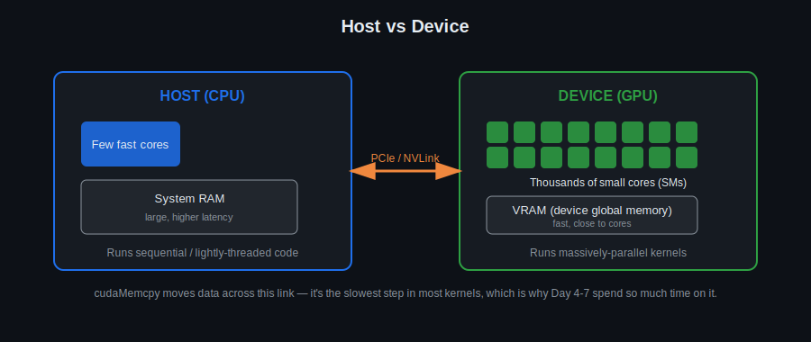

# Day 1: CUDA Basics and Programming Model

## Objectives
- Explain the host/device relationship and why GPUs parallelize work differently than CPUs
- Describe the CUDA programming model: kernels, threads, blocks, grids
- Compile and run a first `.cu` program with `nvcc`, and understand what nvcc actually does under the hood
- Reason about GPU architecture fundamentals (SMs, cores, warps at a high level)
- Check every CUDA call's result, and understand why kernel launches need a different check than everything else

## Key Concepts
- CUDA programming model overview
- Host vs Device
- GPU architecture fundamentals
- Thread hierarchy overview
- `nvcc`: host/device code split, PTX vs SASS, virtual vs real architecture flags
- Error checking: `CUDA_CHECK`, `CUDA_CHECK_LAST_ERROR`, and why launches need the latter

## Visual


The CPU (host) and GPU (device) have separate memory spaces connected by a relatively slow link (PCIe or NVLink). Everything you do in CUDA — allocating device memory, copying data across, launching kernels — is about bridging that gap efficiently. This picture is the mental model for the whole course.

## Error Checking & Debugging
CUDA fails quietly by default, which is the single biggest source of "my kernel ran but nothing happened" confusion for beginners. Fixing that starts today.

**Every CUDA API call returns a `cudaError_t` that gets silently dropped if you don't check it.** [`common/cuda_check.h`](../common/cuda_check.h) defines `CUDA_CHECK(call)`, which wraps a call, checks its result, and exits with a clear file/line/message if it failed:
```c++
CUDA_CHECK(cudaMalloc(&d_ptr, bytes));
CUDA_CHECK(cudaMemcpy(d_ptr, h_ptr, bytes, cudaMemcpyHostToDevice));
```
Every template from today onward includes this header (`#include "../common/cuda_check.h"`) and wraps its CUDA calls in it.

**Kernel launches are different.** `my_kernel<<<grid, block>>>(...)` returns nothing at all — there's no `cudaError_t` to wrap. But the launch can still fail (an invalid grid/block configuration, too much shared memory requested, ...), and if you don't ask, you'll never know. That's what `CUDA_CHECK_LAST_ERROR()` is for — call it immediately after every kernel launch:
```c++
my_kernel<<<grid, block>>>(...);
CUDA_CHECK_LAST_ERROR();
```
Without it, an invalid launch just does nothing, and your program carries on as if everything were fine — exactly the "silent failure" beginners run into and can't explain.

**`compute-sanitizer`** (bundled with the CUDA toolkit, formerly `cuda-memcheck`) catches problems `CUDA_CHECK` can't: out-of-bounds device memory access, uninitialized reads, and — with its `racecheck` tool — shared-memory races between threads in the same block. Worth running once now on a deliberately broken kernel so you know it exists before you actually need it:
```bash
compute-sanitizer ./day01                     # default: memcheck (out-of-bounds/misaligned access)
compute-sanitizer --tool racecheck ./day01     # shared-memory race detection
```

## Toolchain: nvcc
`nvcc` is a *compiler driver*, not a single monolithic compiler. Understanding what it actually does removes a lot of mystery from later "why won't this run on my GPU" bugs.

**How nvcc splits your code**
- A `.cu` file is split into host code and device code (anything inside `__global__`/`__device__` functions, plus kernel launch syntax).
- Host code is handed off, mostly unchanged, to your normal host compiler (gcc/clang/MSVC — pick one explicitly with `-ccbin` if you need a specific version, e.g. `-ccbin gcc-7`, which is exactly what [`examples/matrix_add.cu`](../examples/matrix_add.cu)'s compile comment does).
- Device code goes through nvcc's own front end and is compiled to **PTX** — a virtual, forward-compatible assembly language, *not* real machine code yet.
- `ptxas` then assembles PTX into **SASS**, the actual machine code (cubin) for one specific GPU architecture.
- The result is a "fat binary": one executable can embed SASS for several architectures plus PTX for JIT compilation on anything newer, so the same binary can run on GPUs that didn't exist when you compiled it.

**How architectures are defined**
- `compute_XX` = *virtual* architecture — the feature/PTX target (what instructions the code is allowed to use).
- `sm_XX` = *real* architecture — the actual SASS target (a specific GPU generation's instruction set).
- `-arch=sm_75` is shorthand for `-gencode arch=compute_75,code=sm_75` — compile PTX targeting compute_75, then assemble real SASS for sm_75.
- `-gencode` can be repeated to embed multiple architectures in one binary, e.g.:
  ```
  nvcc -gencode arch=compute_70,code=sm_70 \
       -gencode arch=compute_80,code=sm_80 \
       -gencode arch=compute_80,code=compute_80 \
       kernel.cu -o app
  ```
  The last line (`code=compute_80`, matching arch) embeds *PTX* rather than SASS, so the driver can JIT-compile it for architectures newer than sm_80 that you didn't explicitly target.
- Forgetting to target the right architecture is a classic beginner error: the build succeeds, but the kernel fails at launch with something like `no kernel image is available for execution on the device` — which `CUDA_CHECK_LAST_ERROR()` will now actually tell you, instead of leaving you guessing.

**Flags worth knowing**
- `-O3` — host-code optimization level (device code is optimized by `ptxas` more or less independently, mostly controlled by `-G` below).
- `-G` — full device-side debug info, disables most device-code optimizations. Use only when you need `cuda-gdb` step debugging; it will make your kernel noticeably slower.
- `-lineinfo` — embeds source line info *without* disabling optimizations. What you actually want for Nsight Compute/Systems profiling and for readable `cuda-gdb` backtraces on an optimized build. Also improves `compute-sanitizer`'s error locations.
- `--keep` — keeps all intermediate files (`.ptx`, `.cubin`, `.fatbin`, etc.) next to your output, so you can inspect exactly what nvcc generated at each stage.
- `-Xptxas -v` — verbose per-kernel resource usage: registers used, shared memory used, local-memory spills. Essential once you start caring about occupancy (Day 6 onward).
- `-maxrregcount=N` — caps registers per thread to raise occupancy, at the risk of register spilling to slower local memory if you set it too low.
- `--use_fast_math` — trades strict IEEE-754 precision for speed on transcendental functions (`sin`, `exp`, `sqrt`, ...).

## Resources
Lecture:
https://harmanani.github.io/classes/csc447/Notes/Lecture02.pdf

// Programming model
https://developer.nvidia.com/blog/cuda-refresher-cuda-programming-model/

// PPT
http://developer.download.nvidia.com/compute/developertrainingmaterials/presentations/cuda_language/Introduction_to_CUDA_C.pptx

// Resources
https://developer.nvidia.com/cuda-education

https://harmanani.github.io/csc447.html

https://ww2.cs.fsu.edu/~guidry/cuda.ppt

## Hands-On Task
Write and run a minimal kernel that identifies itself (block/thread index) from the device, launched with a small grid/block configuration. This is the "hello world" of CUDA — the goal is a clean compile/run cycle, not performance.

## Self-Learning
Small tasks to reinforce today's material, roughly in increasing difficulty:

1. Write a kernel that prints `Hello from block X, thread Y` using device-side `printf`.
2. Launch the same kernel with different grid/block configurations (e.g. `<<<1,1>>>`, `<<<2,4>>>`, `<<<4,32>>>`) and observe how the identifiers change.
3. Write a kernel where each thread writes its own raw `blockIdx.x` and `threadIdx.x` into two small output arrays (index directly by `blockIdx.x` / `threadIdx.x`, one write per block and per thread respectively); copy back and verify on the host that they match your launch configuration. (Combining block and thread index into one flat "global index" is a Day 2 topic — not needed here.)
4. Launch a trivial kernel with 1 thread vs. with thousands of threads and time both from the host using `<chrono>` (wrap the launch + `cudaDeviceSynchronize()`) — this is your first look at why parallelism matters. Precise device-side timing (`cudaEvent`s) is covered later.
5. Compile today's kernel with `--keep` and look at the generated `.ptx` file. Then compile once with `-arch=sm_50` and once targeting an architecture your GPU doesn't support, and observe the runtime error.
6. Compile with `-Xptxas -v` and read the register/shared-memory usage report for your kernel — you won't be able to act on it meaningfully until later days, but it's worth knowing where to find it now.
7. Deliberately launch `identify_kernel` with an invalid configuration (e.g. `<<<1, 5000>>>`, over the 1024-threads-per-block limit on most GPUs). Comment out `CUDA_CHECK_LAST_ERROR()` and run it — notice nothing visibly goes wrong. Put the check back and run again — notice it now fails loudly, right where the problem is.
8. Introduce a deliberate out-of-bounds write in `identify_kernel` (write to `block_ids[blockIdx.x + 100]`) and run `compute-sanitizer ./day01` against it. Compare the report to what `CUDA_CHECK` alone would have told you (nothing — the write itself doesn't return an error code).

## Code Template
See [`template.cu`](template.cu) for a skeleton to start from.
