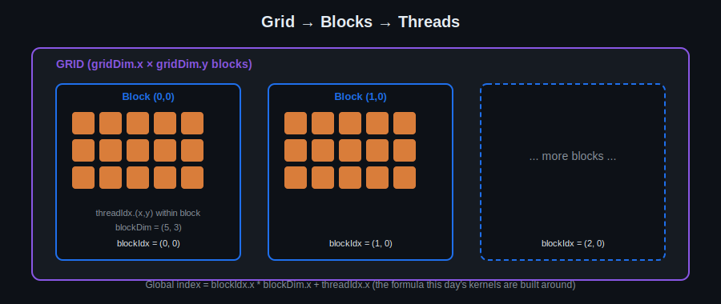

# Day 2: Thread Hierarchy & Execution Model

## Objectives
- Enumerate and divide work across threads, blocks, and grids
- Configure kernel launches correctly for 1D and 2D data
- Apply thread indexing patterns to real data (vectors, then images)

## Key Concepts
- Threads, blocks, grids: structure and enumeration
- Launch configuration and kernel invocation
- Thread indexing patterns

## Visual

A kernel launch creates a grid of blocks, and each block is itself a 1D/2D/3D array of threads. `blockIdx` tells a thread which block it's in; `threadIdx` tells it which slot within that block. The global-index formula in the diagram is the one pattern you'll reuse in nearly every kernel from here on.

## Resources
Threads, blocks, grids
- How to enumerate
- How to devide

[https://slideplayer.com/slide/15057888/](https://eximia.co/understanding-the-basics-of-cuda-thread-hierarchies/)

## Hands-On Task
Example project using VS — add 2 vectors (block/grid config, pipeline), then change it to add 2 images.

## Self-Learning
1. Implement 1D vector addition for a few different array sizes.
2. Extend the kernel to 2D thread indexing and add two grayscale images pixel-by-pixel.
3. Try block sizes of 32, 64, 128, and 256 threads and compare timing — get a first feel for occupancy.
4. Make the kernel correct for array sizes that are *not* an exact multiple of the block size (bounds checking).

## Code Template
See [`template.cu`](template.cu) for a skeleton to start from.
