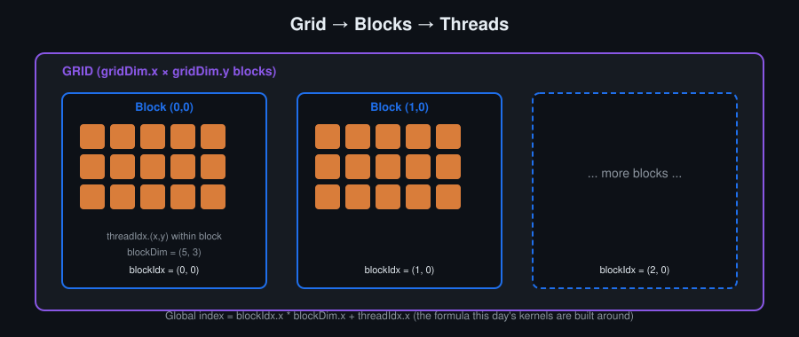

# Day 2: Thread Hierarchy & Execution Model

## Objectives
- Enumerate and divide work across threads, blocks, and grids
- Configure kernel launches correctly for 1D and 2D data
- Apply thread indexing patterns to real data (vectors, then images)
- Recognize coalesced vs. uncoalesced access, and index so a warp's accesses are contiguous
- Reason about occupancy when choosing a block size
- Write a grid-stride loop that handles any input size with a fixed launch configuration

## Key Concepts
- Threads, blocks, grids: structure and enumeration
- Launch configuration and kernel invocation
- Thread indexing patterns
- Memory coalescing — why the index formula is the shape it is
- Occupancy and block-size choice
- Grid-stride loops

## Visual


A kernel launch creates a grid of blocks, and each block is itself a 1D/2D/3D array of threads. `blockIdx` tells a thread which block it's in; `threadIdx` tells it which slot within that block. The global-index formula in the diagram is the one pattern you'll reuse in nearly every kernel from here on.

## Animated


Same formula, four concrete threads: it's always `blockIdx.x * blockDim.x + threadIdx.x`, only the block and thread values change.

## Memory Coalescing

There's a reason the formula is `blockIdx.x * blockDim.x + threadIdx.x` and not, say, `threadIdx.x * gridDim.x + blockIdx.x`. Both give every thread a unique index in `[0, n)`. Both are correct. One of them can be **an order of magnitude slower**, and understanding why is the highest-value thing on this page.


When a warp issues a global load, the memory system doesn't fetch 32 individual values — it fetches whole **128-byte transactions**. If the 32 lanes of a warp ask for 32 consecutive 4-byte words, all 32 requests fall inside a single transaction and the warp is served once. That's a **coalesced** access.

If instead each lane's address is a long stride from its neighbour's, every lane falls in a different 128-byte line. The hardware issues a separate transaction for each one — up to 32 of them — and each drags in 128 bytes to use only 4. You've asked for 128 bytes of useful data and moved 4096.

```c++
// COALESCED — lane 0 reads a[0], lane 1 reads a[1], ... one transaction
int i = blockIdx.x * blockDim.x + threadIdx.x;
c[i] = a[i] + b[i];

// NOT COALESCED — lane 0 reads a[0], lane 1 reads a[gridDim.x], ... 32 transactions
int i = threadIdx.x * gridDim.x + blockIdx.x;
c[i] = a[i] + b[i];
```

**The rule is about the warp, not the thread.** This is the part that trips up everyone arriving from CPU code. On a CPU you want each core walking memory sequentially, because that's what the prefetcher likes. On a GPU that exact pattern — one thread striding through a contiguous run — is the *bad* case. What you want is 32 threads each grabbing one adjacent element at the same instant, so their combined footprint is contiguous. The access pattern that matters is the one formed *across* a warp in a single instruction, not the one formed over time by one thread.

Practical consequences you'll use from here on:

- Keep `threadIdx.x` in the fastest-varying position of your index expression. If it's multiplied by anything, you've introduced a stride.
- For 2D data (the image kernels in `template.cu`, and everything from Day 5 on), map `threadIdx.x` to the **column** and `threadIdx.y` to the **row**. Rows are contiguous in memory; columns aren't. Swapping these two lines is a silent 10× loss that produces perfectly correct output.
- Prefer struct-of-arrays to array-of-structs. With `struct {float x, y, z;} p[N]`, reading `p[i].x` across a warp is a stride-3 access; three separate `x[]`, `y[]`, `z[]` arrays are all stride-1.

Everything Days 4–13 do about memory — pinned transfers, shared-memory tiling, `__ldg`, cache hints — is a refinement on top of this. If the access pattern is uncoalesced, none of them will save you. See [PERFORMANCE.md §1](../PERFORMANCE.md#1-coalescing) for how to measure it with `ncu`, and Day 13 for the measured comparison.

## Occupancy

Self-Learning task 3 below has you time block sizes 32, 64, 128 and 256. Here's the framework for interpreting what you'll see, because "256 was fastest" isn't a lesson.

**Occupancy** is the ratio of warps resident on an SM to the maximum that SM could hold. It matters because of latency hiding (Day 3): when a warp stalls waiting on a memory load — hundreds of cycles — the scheduler covers the gap by issuing from a *different* resident warp. With too few resident warps, there's nothing to switch to and the SM idles through every stall.

Three resources compete, and whichever runs out first sets your occupancy:

- **Threads per SM** — a hard limit (`maxThreadsPerMultiProcessor`, printed by `report_device_capabilities()`).
- **Registers per SM** — divided among all resident threads. Check usage with `nvcc -Xptxas -v` (Day 1).
- **Shared memory per SM** — divided among all resident blocks. Doesn't bite until Day 5.

That explains the block-size result directly. A 32-thread block is one warp; if your GPU caps blocks-per-SM at, say, 16, you can only ever have 16 warps resident out of a possible 64 — 25% occupancy, and three quarters of your latency-hiding capacity is unreachable *no matter what else you do*. At 256 threads (8 warps/block) two blocks already fill half the SM. This is why block sizes below 128 are usually a mistake, and why every block size should be a multiple of 32 — a 100-thread block silently rounds up to 4 warps with 28 lanes permanently idle.

You don't have to work it out by hand:

```c++
int blockSize, minGridSize;
cudaOccupancyMaxPotentialBlockSize(&minGridSize, &blockSize, vector_add, 0, 0);
printf("suggested block size: %d\n", blockSize);
```

**But don't over-index on it.** Occupancy is a means to latency hiding, not a goal in itself. Returns flatten out past roughly 50%, and some of the fastest kernels ever written run at low occupancy on purpose, trading resident warps for more registers and more independent work per thread. Treat below ~30% as worth investigating and 60%-vs-75% as noise. [PERFORMANCE.md §2](../PERFORMANCE.md#2-occupancy) has the worked arithmetic for which resource is actually binding.

## Grid-Stride Loops
Every kernel so far launches exactly enough threads to cover the data, one thread per element. That's fine for a toy example with a known, fixed `n` — but it breaks down fast:

- If `n` isn't known until runtime (loaded from a file, a network request, ...), you have to recompute the grid size every time.
- If `n` is huge, you may not be able to launch enough threads/blocks to cover it in one shot on every GPU.
- Get the grid-size arithmetic wrong (an off-by-one in `divUp`) and some elements are silently never processed — no error, no crash, just quietly wrong output.

The fix is a **grid-stride loop**: launch a *fixed* number of threads (chosen based on your GPU's occupancy, not on `n`), and have each thread process multiple elements in a loop, striding by the total thread count each time:

```c++
int idx = blockIdx.x * blockDim.x + threadIdx.x;
int stride = gridDim.x * blockDim.x;
for (int i = idx; i < n; i += stride) {
    c[i] = a[i] + b[i];
}
```

This is the pattern real (non-toy) CUDA code uses. `vector_add_grid_stride` in [`template.cu`](template.cu) is launched with a fixed `<<<256, 256>>>` regardless of `n` — try changing `n` to something much larger and confirm the same launch configuration still produces correct output.



The same 4 threads process all 16 elements in 4 iterations — double the array to 32 elements and it just takes 8 iterations with the exact same launch configuration.

## Resources
Threads, blocks, grids
- How to enumerate
- How to devide

[https://slideplayer.com/slide/15057888/](https://eximia.co/understanding-the-basics-of-cuda-thread-hierarchies/)

## Hands-On Task
Example project using VS — add 2 vectors (block/grid config, pipeline), then change it to add 2 images.

## Self-Learning
1. Implement 1D vector addition for a few different array sizes.
2. Extend the kernel to 2D thread indexing and add two grayscale images pixel-by-pixel.
3. Try block sizes of 32, 64, 128, and 256 threads and compare timing. Then call `cudaOccupancyMaxActiveBlocksPerMultiprocessor` for each and check whether the timings track the occupancy numbers — and where they stop tracking.
4. Make the kernel correct for array sizes that are *not* an exact multiple of the block size (bounds checking).
5. Fill in `vector_add_grid_stride` in [`template.cu`](template.cu). Verify it produces the same result as `vector_add` for the current `n`, then bump `n` to something far larger than `blocks * threads` and confirm it's still correct without changing the launch configuration.
6. Write two versions of a copy kernel — one indexing `blockIdx.x * blockDim.x + threadIdx.x`, one indexing `threadIdx.x * gridDim.x + blockIdx.x` — and time both on a large array. Predict the ratio before you run it, then compute the achieved bandwidth of each as a fraction of the theoretical peak `report_device_capabilities()` printed on Day 1.
7. Take your 2D image-add kernel from task 2 and deliberately swap the row/column roles of `threadIdx.x` and `threadIdx.y`. Confirm the output is still correct, then measure how much slower it got.

## Self-Check
No answers given — these are for you to reason through, or discuss with a classmate/instructor.

1. What's the global-index formula for a 1D kernel, and what goes wrong if you compute it without `blockDim.x`?
2. Why does a grid-stride loop keep producing correct output if you double `n` without changing the launch configuration, while a plain one-thread-per-element kernel doesn't?
3. If you launch `<<<100, 256>>>` for an array of 20,000 elements with proper bounds checking, roughly how many threads do no work at all?
4. A colleague argues that having each thread process a contiguous chunk of 32 elements must be faster than a grid-stride loop, "because sequential access is faster." What's wrong with that reasoning on a GPU, and where does the intuition come from?
5. Both index formulas in the coalescing section produce correct output. If the slow one is never *wrong*, what would make you notice it in a real codebase?
6. Why is a block size of 100 threads a worse choice than either 96 or 128?

## Code Template
See [`template.cu`](template.cu) for a skeleton to start from.
