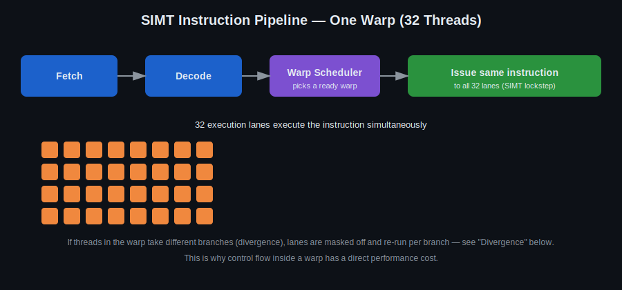
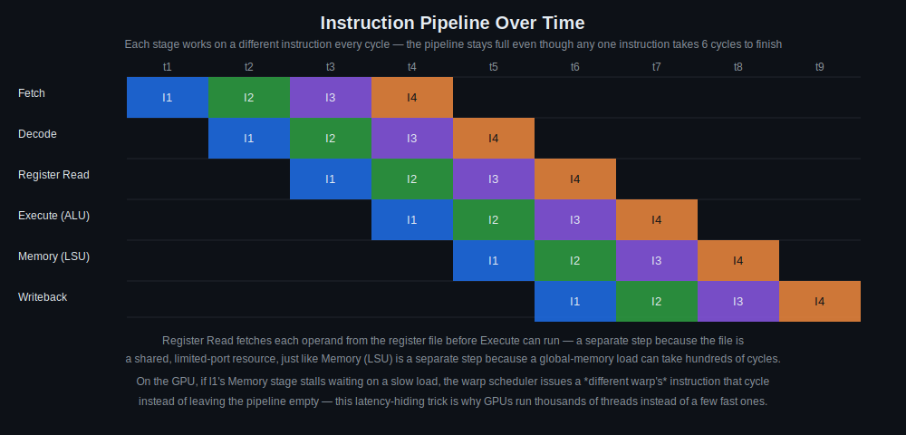

# Day 3: Warp-Level Execution and Control Flow

## Objectives
- Explain SIMD/SIMT execution and how the GPU instruction pipeline issues one instruction to a whole warp
- Define what a warp is and how it executes instructions in lockstep
- Reason about control flow (`if`/`else`, loops, `switch`) and its cost inside a warp
- Recognize and avoid warp divergence
- Apply loop unrolling where it helps

## Key Concepts
- SIMD architecture and the instruction pipeline (fetch → decode → warp scheduler → lockstep issue)
- Warp definition and behavior
- Control flow: `if`, `else`, `for`, `while`
- Loop unrolling
- Divergence impact and avoidance

## Visual


One instruction is fetched and decoded once, then the warp scheduler issues it to all 32 threads in a warp simultaneously (SIMT). This is *why* warp divergence is expensive: if threads in a warp disagree on a branch, the hardware masks off lanes and runs each branch path separately instead of truly in parallel.



The picture above shows one instruction moving through the pipeline; this one shows *time* — at t1 only I1 is being fetched, at t2 I1 moves to Decode while I2 is fetched, and so on until the pipeline is full and a new instruction retires every cycle. Register Read and Memory are their own stages because the register file and global memory are both shared, limited resources with real access latency. When one warp stalls in Memory waiting on a slow load, the scheduler fills that cycle with a different warp's instruction instead of leaving the pipeline empty — that's the latency-hiding this whole course keeps coming back to.

## Animated


Watch how the scheduler is never left with nothing to do — as soon as one warp goes "not ready" (standing in for a memory or execution latency), another resident warp is ready to take its place. This is latency hiding, playing out continuously.


The two branch paths run one after another, not simultaneously — divergence serializes a warp instead of adding real parallelism.

For a fully interactive, playable version (step-by-step, pause anytime) see [`warp_animations.html`](warp_animations.html) — open it locally in a browser, since GitHub's file viewer only shows HTML as source rather than running it.

## Resources
https://people.maths.ox.ac.uk/~gilesm/cuda/lecs/lec3.pdf

https://developer.nvidia.com/blog/using-cuda-warp-level-primitives/

Instructions pipeline:
https://lowyx.com/posts/gt-gpu-notes/

Hint: https://people.maths.ox.ac.uk/~gilesm/cuda/

- If/else
- for loop
- while/do while
- switch-case
+ loop unrolling

## Code Walkthrough
Warp-level reduction, with a debug-mode fallback using `__shfl_xor_sync`:

```c++
// --- Allocate temporary storage in shared memory
#ifdef NDEBUG
	typedef cub::WarpReduce<int> WarpReduceT;

	 __shared__ typename WarpReduceT::TempStorage temp_storage;
	const auto result = WarpReduceT(temp_storage).Sum(r);
#else
	// in debug mode, it consumes much resources, so lets use this one
	int result = r;
#pragma unroll
	for (auto i = 1; i < 32; i *= 2) {
		result += __shfl_xor_sync(0xFFFFFFFF, result, i);
	}
#endif
```


Large vector addition kernel (ignore warp logic for this part — see Self-Learning below):

```c++
// Kernel
__global__ void add_vectors(double *a, double *b, double *c)
{
    int id = blockDim.x * blockIdx.x + threadIdx.x;
    if(id < N) c[id] = a[id] + b[id];
}

// Allocate device memory for arrays d_A, d_B, and d_C
double *d_A, *d_B, *d_C;
cudaMalloc(&d_A, bytes);
cudaMalloc(&d_B, bytes);
cudaMalloc(&d_C, bytes);

// Copy data from host arrays A and B to device arrays d_A and d_B
cudaMemcpy(d_A, A, bytes, cudaMemcpyHostToDevice);
cudaMemcpy(d_B, B, bytes, cudaMemcpyHostToDevice);

 // Launch kernel
add_vectors<<< blk_in_grid, thr_per_blk >>>(d_A, d_B, d_C);

// Copy data from device array d_C to host array C
cudaMemcpy(C, d_C, bytes, cudaMemcpyDeviceToHost);
```

## Hands-On Task
Large vector addition and time estimation (ignore warp logic at this point). Then: BGR to grayscale conversion with CUDA.

## Self-Learning
1. Implement the large vector addition above and time it against an equivalent CPU loop.
2. Convert a BGR image to grayscale in a kernel (`gray = 0.114*B + 0.587*G + 0.299*R`).
3. Deliberately introduce branch divergence (e.g. `if (threadIdx.x % 2 == 0)`) in a kernel and measure the performance hit vs. a divergence-free version.
4. Apply `#pragma unroll` to a small fixed-trip-count loop in one of your kernels and compare generated performance.

## Self-Check
No answers given — these are for you to reason through, or discuss with a classmate/instructor.

1. Why is warp divergence expensive even though every thread eventually does its "useful" work?
2. In the fetch/decode/register-read/execute/memory/writeback pipeline, why are register read and memory access separate stages instead of folded into execute?
3. If half a warp takes an `if` branch and the other half takes `else`, roughly how does that warp's execution time compare to a divergence-free warp doing the same total work?

## Code Template
See [`template.cu`](template.cu) for a skeleton to start from.
