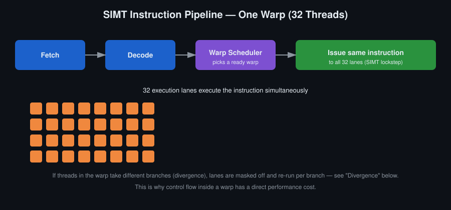
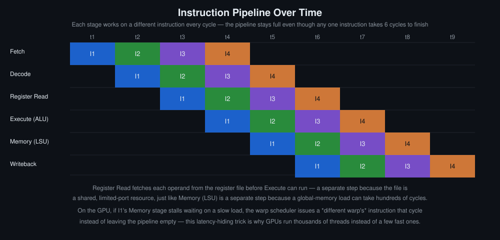

# Day 3: Warp-Level Execution and Control Flow

## Objectives
- Explain SIMD/SIMT execution and how the GPU instruction pipeline issues one instruction to a whole warp
- Define what a warp is and how it executes instructions in lockstep
- Reason about control flow (`if`/`else`, loops, `switch`) and its cost inside a warp
- Recognize and avoid warp divergence
- Apply loop unrolling where it helps

## Key Concepts
- SIMD architecture and the instruction pipeline (fetch → decode → warp scheduler → lockstep issue)
- Warp definition and behavior
- Control flow: `if`, `else`, `for`, `while`
- Loop unrolling
- Divergence impact and avoidance

## Definitions · Սահմանումներ

*Terms introduced today. Same text as the matching entries in [GLOSSARY.md](../GLOSSARY.md).*

**Warp** — Block-ի 32 thread-ից բաղկացած խումբ, որը hardware-ը պլանավորում և կատարում է որպես մեկ միավոր։ Warp-ի հրամանը միաժամանակ ուղարկվում է նրա բոլոր 32 thread-երին։ Warp մակարդակի intrinsic-ներն աշխատում են հենց այս միավորի վրա։

**SIMT (Single Instruction, Multiple Threads)** — NVIDIA-ի կատարման մոդելը. հրամանը մեկ անգամ է կարդացվում և վերծանվում, ապա միաժամանակ ուղարկվում warp-ի բոլոր 32 thread-երին։

**Հրամանների pipeline** — Փուլերը, որոնցով անցնում է հրամանը՝ fetch, decode, register read, execute, memory, writeback։ Ամեն պահի pipeline-ում կա մի քանի հրաման, ամեն փուլում՝ մեկը։

**Register file** — SM-ի ռեգիստրների ընդհանուր պահոցը, որից ռեգիստրներ են ստանում SM-ի բոլոր thread-երը։ Դրա չափը ֆիքսված է։ Որքան շատ ռեգիստր է օգտագործում մեկ thread-ը, այնքան քիչ warp կարող է resident լինել։

**Active, eligible և stalled warp** — Warp-ը active է (resident), երբ զբաղեցնում է SM-ի warp slot-երից մեկը։ Active warp-ը **eligible** է (պատրաստ է), երբ կարող է ուղարկել իր հաջորդ հրամանը։ Դրա համար պետք է երեք պայման. հրամանն արդեն վերծանված է, բոլոր արժեքները, որոնք հրամանը կարդում է, հասանելի են (օրինակ՝ այն load-ը, որից հրամանը կախված է, ավարտվել է), և հրամանը կատարող միավորը (FP32 pipe, load/store unit կամ tensor core) այդ ցիկլում ազատ է։ Եթե պայմաններից որևէ մեկը չի բավարարվում, warp-ը stalled է։ Ամեն ցիկլ scheduler-ն ընտրում է պատրաստ warp-երից մեկը և ուղարկում նրա հրամանը։

**Stall reason** — Profiler-ի դասակարգումը, որը ցույց է տալիս, թե ինչու warp-ը պատրաստ չէր։ NVIDIA-ն առանձնացնում է չորս խումբ. warp-ը սպասում է հրամանի կարդացմանը (instruction fetch), հիշողության գործողության ավարտին (memory dependency), նախորդ հրամանի արդյունքին (execution dependency) կամ սինխրոնացման barrier-ին։ Stall reason-ը ցույց է տալիս, թե կոդում ինչ պետք է ուղղել։

**Latency hiding** — GPU-ի արագագործության հիմնական միջոցը. երբ warp-ը կանգ է առնում, warp scheduler-ը նույն ցիկլում ուղարկում է մեկ այլ պատրաստ warp-ի հրամանը, և pipeline-ը պարապ չի մնում։ Այդ պատճառով GPU-ին պետք են շատ thread-եր, ոչ թե քիչ, բայց արագ thread-եր։

**Divergence (warp divergence)** — Իրավիճակ, երբ մեկ warp-ի thread-երը branch-ում տարբեր ճյուղեր են ընտրում։ Քանի որ warp-ի 32 thread-երն ունեն հրամանների մեկ հոսք, hardware-ը ճյուղերը կատարում է հերթով։ Ամեն ճյուղի ընթացքում մյուս ճյուղի lane-երն անջատված են։

**Reconvergence** — Divergent branch-ից հետո այն կետը, որտեղ warp-ի բոլոր lane-երը նորից կատարում են նույն հրամանը։ Volta-ից սկսած ամեն lane ունի իր program counter-ը, և branch-ի վերջում reconvergence-ն երաշխավորված չէ։ `__syncwarp`-ն այն ապահովում է բացահայտ։

**Loop unrolling** — Ցիկլի մարմինը կոդում կրկնվում է մի քանի անգամ, և ցիկլի կրկնությունների թիվը նվազում է։ Դա հեռացնում է ցիկլի պայմանի և ինդեքսի հրամանները և scheduler-ին տալիս է իրարից անկախ հրամաններ։ Կառավարվում է `#pragma unroll`-ով։

## Functions · Ֆունկցիաներ

*Interfaces introduced today. Full consolidated list in [API.md](../API.md); concepts in [GLOSSARY.md](../GLOSSARY.md).*

```c
// Warp-ի barrier՝ mask-ում նշված lane-երը սպասում են միմյանց
void __syncwarp(unsigned mask = 0xFFFFFFFF);
```

## Visual


One instruction is fetched and decoded once, then the warp scheduler issues it to all 32 threads in a warp simultaneously (SIMT). This is *why* warp divergence is expensive: if threads in a warp disagree on a branch, the hardware masks off lanes and runs each branch path separately instead of truly in parallel.



The picture above shows one instruction moving through the pipeline; this one shows *time* — at t1 only I1 is being fetched, at t2 I1 moves to Decode while I2 is fetched, and so on until the pipeline is full and a new instruction retires every cycle. Register Read and Memory are their own stages because the register file and global memory are both shared, limited resources with real access latency. When one warp stalls in Memory waiting on a slow load, the scheduler fills that cycle with a different warp's instruction instead of leaving the pipeline empty — that's the latency-hiding this whole course keeps coming back to.

## Animated


Watch how the scheduler is never left with nothing to do — as soon as one warp goes "not ready" (standing in for a memory or execution latency), another resident warp is ready to take its place. This is latency hiding, playing out continuously.


The two branch paths run one after another, not simultaneously — divergence serializes a warp instead of adding real parallelism.

For a fully interactive, playable version (step-by-step, pause anytime) see [`warp_animations.html`](warp_animations.html) — open it locally in a browser, since GitHub's file viewer only shows HTML as source rather than running it.

## Resources
https://people.maths.ox.ac.uk/~gilesm/cuda/lecs/lec3.pdf

https://developer.nvidia.com/blog/using-cuda-warp-level-primitives/

Instructions pipeline:
https://lowyx.com/posts/gt-gpu-notes/

Hint: https://people.maths.ox.ac.uk/~gilesm/cuda/

- If/else
- for loop
- while/do while
- switch-case
+ loop unrolling

## Code Walkthrough

### Where divergence falls relative to the warp

The cost of a branch has nothing to do with how complicated the condition is. It depends entirely on whether the 32 lanes of a warp agree on the answer.

```c++
// DIVERGENT: lanes alternate, so every warp takes both paths.
// The warp runs A() with the odd lanes masked off, then B() with the even
// lanes masked off. Cost = A + B, every warp, always.
if (threadIdx.x % 2 == 0) { A(); } else { B(); }

// FREE: the condition is constant across each warp, so each warp takes
// exactly one path and nothing is masked. Cost = A or B, never both.
if ((threadIdx.x / 32) % 2 == 0) { A(); } else { B(); }
```

Same branch, same total work, completely different cost. Self-Learning task 3 below is this comparison, measured.

Two sources of divergence that don't look like branches:

```c++
// A bounds check IS a branch. Harmless here -- only the last warp diverges,
// and only on its tail -- but the same shape inside a loop is not.
if (id < n) c[id] = a[id] + b[id];

// A data-dependent trip count: the whole warp runs until the LAST lane
// finishes, so one outlier lane costs every lane in the warp.
while (residual[id] > tol) { ... }
```

### Loop unrolling

```c++
// The compiler knows the trip count, so it will usually unroll this anyway.
for (int k = 0; k < 4; ++k) sum += w[k] * x[i + k];

// Say it explicitly when the trip count is a compile-time constant and you
// want the branch and index arithmetic gone for certain.
#pragma unroll
for (int k = 0; k < 4; ++k) sum += w[k] * x[i + k];

// And the opposite: stop the compiler unrolling a large loop into a register
// blowup that costs you occupancy (Day 2).
#pragma unroll 1
for (int k = 0; k < BIG; ++k) { ... }
```

Unrolling removes the loop counter increment, the comparison and the branch, and it exposes independent multiply-adds the scheduler can overlap. It costs registers and instruction cache. Check with `nvcc -Xptxas -v` (Day 1) whether an unroll pushed register usage up far enough to cost you resident warps — that's the trade, and it's measurable rather than a matter of taste.

### Large vector addition

The kernel the Hands-On task below builds on:

```c++
// Kernel
__global__ void add_vectors(double *a, double *b, double *c)
{
    int id = blockDim.x * blockIdx.x + threadIdx.x;
    if(id < N) c[id] = a[id] + b[id];
}

// Allocate device memory for arrays d_A, d_B, and d_C
double *d_A, *d_B, *d_C;
cudaMalloc(&d_A, bytes);
cudaMalloc(&d_B, bytes);
cudaMalloc(&d_C, bytes);

// Copy data from host arrays A and B to device arrays d_A and d_B
cudaMemcpy(d_A, A, bytes, cudaMemcpyHostToDevice);
cudaMemcpy(d_B, B, bytes, cudaMemcpyHostToDevice);

 // Launch kernel
add_vectors<<< blk_in_grid, thr_per_blk >>>(d_A, d_B, d_C);

// Copy data from device array d_C to host array C
cudaMemcpy(C, d_C, bytes, cudaMemcpyDeviceToHost);
```

## Hands-On Task
Large vector addition and time estimation. Then: BGR to grayscale conversion with CUDA.

## Self-Learning
1. Implement the large vector addition above and time it against an equivalent CPU loop.
2. Convert a BGR image to grayscale in a kernel (`gray = 0.114*B + 0.587*G + 0.299*R`).
3. Deliberately introduce branch divergence (e.g. `if (threadIdx.x % 2 == 0)`) in a kernel and measure the performance hit vs. a divergence-free version.
4. Apply `#pragma unroll` to a small fixed-trip-count loop in one of your kernels and compare generated performance.

## Self-Check
No answers given — these are for you to reason through, or discuss with a classmate/instructor.

1. Why is warp divergence expensive even though every thread eventually does its "useful" work?
2. In the fetch/decode/register-read/execute/memory/writeback pipeline, why are register read and memory access separate stages instead of folded into execute?
3. If half a warp takes an `if` branch and the other half takes `else`, roughly how does that warp's execution time compare to a divergence-free warp doing the same total work?

## Code Template
See [`template.cu`](template.cu) for a skeleton to start from.

No CUDA GPU on your machine? Run this lab in the [course Colab notebook](https://colab.research.google.com/drive/1zDtYkz8WwD7sOIucSyUoxm2n7RYWJxVZ?usp=sharing) instead — free T4, compute capability 7.5, which is exactly the `-arch=sm_75` the template compiles for. Setup and caveats are in the [root README](../README.md#-no-cuda-gpu-start-here).
