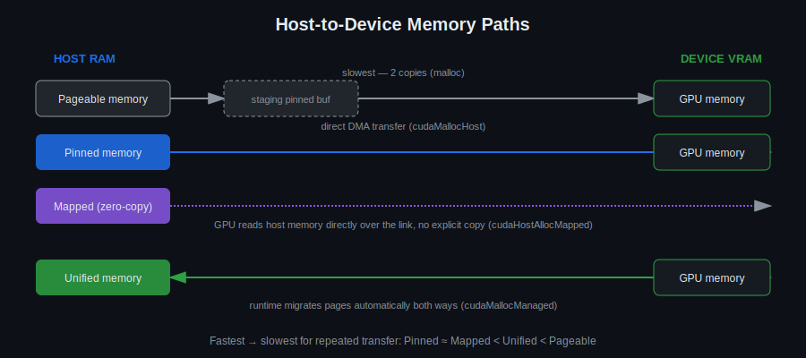

# Day 4: CUDA Memory Types and Management

## Objectives
- Distinguish paged, pinned, page-locked, mapped, and unified memory
- Know the API for each (`malloc`, `cudaMallocHost`, `cudaHostRegister`, `cudaHostAlloc`, `cudaMallocManaged`)
- Explain the pros/cons and typical use case of each
- Use a profiler (Nsight Systems) to see the effect of memory choice on transfer time

## Key Concepts
- Paged, pinned, and mapped memory
- Unified memory
- Allocation strategies

Memory management system:
- paged memory (refer to OS mem paging) — `malloc`, pros, cons
- pinned memory — `cudaMallocHost`, pros, cons
- page locking (preventing OS to move pages around) — `cudaHostRegister`, pros, cons
- mapped memory (zero-copy memory) — `cudaHostAlloc` with `cudaHostAllocMapped` flag set, pros, cons
- unified memory — `cudaMallocManaged`, pros, cons, `__managed__`

## Visual

Every memory type is really a different answer to the same question: how does data get from host RAM to device VRAM? Pageable memory needs a hidden staging copy; pinned memory skips it; mapped memory skips the copy entirely by letting the GPU read host RAM directly (at the cost of per-access latency); unified memory lets the runtime decide automatically.

## Looking ahead: pinned memory in OpenCV
Starting Day 5 this course uses OpenCV's `cv::cuda::GpuMat` for image I/O. The library has its own name for pinned memory: `cv::cuda::HostMem`. `GpuMat::download()`/`upload()` into a `cv::Mat` always uses a regular (pageable) host buffer under the hood; downloading into a `cv::cuda::HostMem` instead — and passing a `cv::cuda::Stream` — gets you the same direct-DMA, non-blocking transfer that `cudaMallocHost` gets you here, just through OpenCV's API instead of the raw CUDA one.

## Resources
[https://medium.com/analytics-vidhya/cuda-memory-model-823f02cef0bf](https://developer.codeplay.com/products/computecpp/ce/1.3.0/guides/sycl-for-cuda-developers/memory-model)

## Hands-On Task
Use pinned memory. Improve the Day 2/3 vector-add algorithm using pinned memory and monitor the difference using Nsight Systems.

## Self-Learning
1. Benchmark `cudaMemcpy` using pageable host memory vs. pinned host memory (`cudaMallocHost`) for a large transfer.
2. Take an existing pageable buffer and page-lock it in place with `cudaHostRegister` instead of allocating pinned memory up front — compare.
3. Rewrite the Day 2/3 vector-add to use `cudaMallocManaged` (unified memory) and compare code complexity and performance.
4. Profile all three variants with Nsight Systems and compare the transfer timelines.

## Self-Check
No answers given — these are for you to reason through, or discuss with a classmate/instructor.

1. Why is a pageable-to-device `cudaMemcpy` slower than a pinned-to-device one, even though it moves the exact same bytes?
2. What's the downside of allocating too much pinned memory system-wide, and why doesn't everyone just pin everything?
3. When would zero-copy (mapped) memory actually outperform copying data to the device first?

## Code Template
See [`template.cu`](template.cu) for a skeleton to start from.
