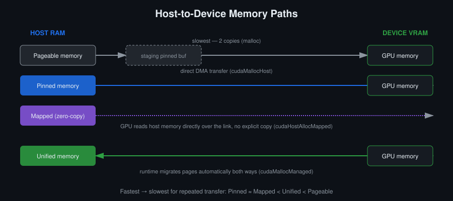

# Day 4: CUDA Memory Types and Management

## Objectives
- Distinguish paged, pinned, page-locked, mapped, and unified memory
- Explain what page-locking actually does, and why the DMA engine requires it
- Know the API for each (`malloc`, `cudaMallocHost`, `cudaHostRegister`, `cudaHostAlloc`, `cudaMallocManaged`)
- Explain the pros/cons and typical use case of each, including the cost of over-pinning
- Use a profiler (Nsight Systems) to see the effect of memory choice on transfer time

## Key Concepts
- Paged, pinned, and mapped memory
- Unified memory
- Allocation strategies

Memory management system:
- paged memory (refer to OS mem paging) — `malloc`, pros, cons
- pinned memory — `cudaMallocHost`, pros, cons
- page locking (preventing OS to move pages around) — `cudaHostRegister`, pros, cons
- mapped memory (zero-copy memory) — `cudaHostAlloc` with `cudaHostAllocMapped` flag set, pros, cons
- unified memory — `cudaMallocManaged`, pros, cons, `__managed__`

## Visual


Every memory type is really a different answer to the same question: how does data get from host RAM to device VRAM? Pageable memory needs a hidden staging copy; pinned memory skips it; mapped memory skips the copy entirely by letting the GPU read host RAM directly (at the cost of per-access latency); unified memory lets the runtime decide automatically.

## Page-Locking: the mechanism behind "pinned"

### What "locked" actually locks


Everything about pinned memory follows from one fact, and the animation above is that fact in four states.

**Your pointer is a virtual address.** The buffer `malloc` handed you looks contiguous, but the OS has scattered it across physical frames wherever there was room. A page table records which virtual page currently lives in which frame.

**The OS may rewrite that table whenever it likes** — states 2 and 3. It can relocate a page to a different frame under memory pressure, or evict it to disk entirely. Both are invisible to you: the OS fixes up the page table, so your pointer keeps working exactly as before.

**The GPU's copy engine cannot follow any of this.** It sits on the far side of PCIe with no access to your process's page table, so it works in *physical* addresses only. Hand it a physical address and the OS moves that page a microsecond later, and the engine reads whatever now occupies the frame — another process's data, or nothing.

So the driver's hands are tied: for pageable memory it must copy your data into a small buffer *it* has already locked, and DMA that instead. That's the hidden staging copy, and it's why the path looks like this:


**Page-locking** ("pinning") is the OS agreeing not to move or evict those specific frames. The physical address is now stable for as long as the lock holds, the copy engine reads your buffer directly, and the CPU never touches the data — which is what makes the transfer overlappable with kernel execution.

Note what it is *not*: pinning doesn't make memory contiguous, doesn't move it anywhere, and doesn't change your pointer. It only removes the OS's freedom to relocate it.

Two consequences worth remembering, both of which cost people real time:

- **`cudaMemcpyAsync` on pageable memory is silently synchronous.** The runtime cannot DMA it, so it falls back to a blocking copy and does not warn you. Day 7's whole overlap exercise depends on getting this right.
- **Pinning is not free.** Locked pages can't be swapped, so over-pinning starves the OS and slows the entire machine, not just your process. Pin the buffers you transfer repeatedly, not everything.

### Two routes: allocate pinned, or pin what you have

```c++
// Route 1 -- you control the allocation
cudaMallocHost(&p, n);                 // allocated already pinned
cudaFreeHost(p);

// Route 2 -- the buffer already exists and you can't replace it
cudaHostRegister(p, n, cudaHostRegisterDefault);   // pin it in place
cudaHostUnregister(p);                             // ALWAYS before free()
```

`cudaHostRegister(void *ptr, size_t size, unsigned int flags)` is the one to reach for with legacy code, a third-party library's buffer, or a container you don't own — anywhere you can't swap `malloc` for `cudaMallocHost`. The flags worth knowing:

| Flag | Effect |
|---|---|
| `cudaHostRegisterDefault` | Plain page-lock, for faster `cudaMemcpy` |
| `cudaHostRegisterPortable` | Pinned as far as *all* CUDA contexts are concerned, not just the current one |
| `cudaHostRegisterMapped` | Also maps it into the device address space — this is how you get zero-copy (below) on a buffer you already had |

Forgetting `cudaHostUnregister` before freeing the host allocation leaves the driver holding a lock on memory that no longer belongs to you: a leak at best, undefined behaviour at worst.

## Looking ahead: pinned memory in OpenCV
Starting Day 5 this course uses OpenCV's `cv::cuda::GpuMat` for image I/O. The library has its own name for pinned memory: `cv::cuda::HostMem`. `GpuMat::download()`/`upload()` into a `cv::Mat` always uses a regular (pageable) host buffer under the hood; downloading into a `cv::cuda::HostMem` instead — and passing a `cv::cuda::Stream` — gets you the same direct-DMA, non-blocking transfer that `cudaMallocHost` gets you here, just through OpenCV's API instead of the raw CUDA one.

## Resources
- [CUDA memory model](https://medium.com/analytics-vidhya/cuda-memory-model-823f02cef0bf)
- [The CUDA memory model, from a SYCL angle](https://developer.codeplay.com/products/computecpp/ce/1.3.0/guides/sycl-for-cuda-developers/memory-model)

## Hands-On Task
Use pinned memory. Improve the Day 2/3 vector-add algorithm using pinned memory and monitor the difference using Nsight Systems.

## Self-Learning
1. Benchmark `cudaMemcpy` using pageable host memory vs. pinned host memory (`cudaMallocHost`) for a large transfer.
2. Take an existing pageable buffer and page-lock it in place with `cudaHostRegister` instead of allocating pinned memory up front — compare. Time the `cudaHostRegister` call itself too: pinning is not instant, so it only pays off if you transfer the buffer more than once.
2b. Issue a `cudaMemcpyAsync` on a *pageable* buffer and time it against the same call on a pinned one. Confirm in Nsight Systems that the pageable version did not actually run asynchronously, even though the API call returned immediately.
3. Rewrite the Day 2/3 vector-add to use `cudaMallocManaged` (unified memory) and compare code complexity and performance.
4. Profile all three variants with Nsight Systems and compare the transfer timelines.

## Self-Check
No answers given — these are for you to reason through, or discuss with a classmate/instructor.

1. Why is a pageable-to-device `cudaMemcpy` slower than a pinned-to-device one, even though it moves the exact same bytes?
2. What's the downside of allocating too much pinned memory system-wide, and why doesn't everyone just pin everything?
3. When would zero-copy (mapped) memory actually outperform copying data to the device first?
4. You call `cudaMemcpyAsync` on a `malloc`'d buffer and it returns immediately, but the profiler shows no overlap with your kernel. What happened, and why did nothing report an error?
5. A colleague pins every host buffer in the application "to be safe" and the whole machine — including unrelated processes — gets slower. Explain the mechanism.
6. When is `cudaHostRegister` the right tool rather than just switching the allocation to `cudaMallocHost`?
7. The OS relocates one of your pages to a different physical frame. Your CPU code notices nothing and keeps running correctly. Why can't the GPU's copy engine be given the same treatment?
8. Pinning does not make a buffer physically contiguous. Given that, how does the copy engine transfer a 4 MB pinned buffer that is scattered across a thousand unrelated frames?

## Code Template
See [`template.cu`](template.cu) for a skeleton to start from.

No CUDA GPU on your machine? Run this lab in the [course Colab notebook](https://colab.research.google.com/drive/1zDtYkz8WwD7sOIucSyUoxm2n7RYWJxVZ?usp=sharing) instead — free T4, compute capability 7.5, which is exactly the `-arch=sm_75` the template compiles for. Setup and caveats are in the [root README](../README.md#-no-cuda-gpu-start-here).
