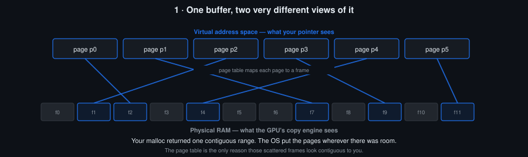
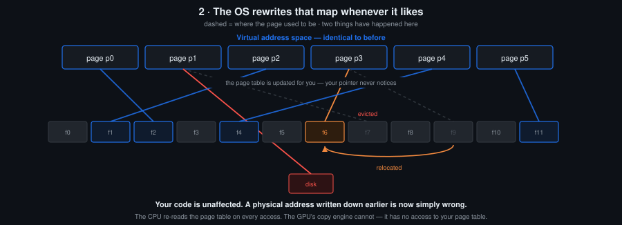
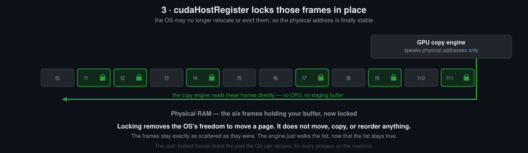

# Day 4: CUDA Memory Types and Management

## Objectives
- Distinguish paged, pinned, page-locked, mapped, and unified memory
- Explain what page-locking actually does, and why the DMA engine requires it
- Know the API for each (`malloc`, `cudaMallocHost`, `cudaHostRegister`, `cudaHostAlloc`, `cudaMallocManaged`)
- Explain the pros/cons and typical use case of each, including the cost of over-pinning
- Distinguish zero-copy's per-access bus traffic from unified memory's per-migration page traffic, and recognize ping-ponging
- Use `__managed__` for small host/device-shared variables without an explicit allocation
- Use a profiler (Nsight Systems) to see the effect of memory choice on transfer time

## Key Concepts
- Paged, pinned, and mapped memory
- Unified memory
- Allocation strategies

Memory management system:
- paged memory (refer to OS mem paging) — `malloc`, pros, cons
- pinned memory — `cudaMallocHost`, pros, cons
- page locking (preventing OS to move pages around) — `cudaHostRegister`, pros, cons
- mapped memory (zero-copy memory) — `cudaHostAlloc` with `cudaHostAllocMapped` flag set, pros, cons
- unified memory — `cudaMallocManaged`, pros, cons, `__managed__`

## Visual


Every memory type is really a different answer to the same question: how does data get from host RAM to device VRAM? Pageable memory needs a hidden staging copy; pinned memory skips it; mapped memory skips the copy entirely by letting the GPU read host RAM directly (at the cost of per-access latency); unified memory lets the runtime decide automatically.

## The Five Types at a Glance

| | **Pageable** | **Pinned** | **Mapped (zero-copy)** | **Unified (managed)** | **Device** |
|---|---|---|---|---|---|
| **Allocate** | `malloc` / `new` | `cudaMallocHost`<br>or `cudaHostRegister` | `cudaHostAlloc(..., cudaHostAllocMapped)` | `cudaMallocManaged`<br>or `__managed__` | `cudaMalloc` |
| **Free** | `free` / `delete` | `cudaFreeHost`<br>/ `cudaHostUnregister` | `cudaFreeHost` | `cudaFree` | `cudaFree` |
| **Page-locked?** | No | Yes | Yes | n/a (driver-managed) | n/a (device memory) |
| **Where does the data live?** | Host RAM | Host RAM | Host RAM, always | Wherever last touched | Device VRAM |
| **Host can access?** | Yes | Yes | Yes | Yes | **No** |
| **Kernel can access?** | **No** | No — must be copied | Yes, directly | Yes | Yes |
| **How it reaches the GPU** | CPU copy → driver's staging buffer → DMA | One DMA | Never does; the kernel reaches across PCIe per access | Whole pages migrate on fault | Already there |
| **Cost model** | Two copies per transfer | One copy per transfer | **Per access** | **Per migration** | None |
| **`cudaMemcpyAsync` truly async?** | **No** — silently synchronous | Yes | n/a | n/a | Yes |
| **Cached on device?** | n/a | n/a | **No** | Yes, once resident | Yes |
| **Main risk** | Hidden staging copy you never see | Over-pinning starves the OS | Re-reading data ⇒ repeated bus traffic | Ping-ponging between host and device | Manual copies to keep in sync |
| **Reach for it when** | Default; data you rarely transfer | Any buffer you transfer repeatedly, and anything async | Streaming data touched exactly once, or an integrated GPU | Prototyping, irregular or pointer-based structures | The normal case for data a kernel works on |

Three rows carry most of the practical weight:

- **"Kernel can access?"** separates the two groups. Pageable and pinned memory must still be *copied*; mapped and unified are reachable from a kernel by pointer. Pinned memory is faster than pageable, but it is not a way to skip the copy.
- **"Cost model"** is the real distinction between the two pointer-reachable options, and the one most often confused. Zero-copy never moves a page and charges you per access; unified moves whole pages and charges you per migration.
- **"`cudaMemcpyAsync` truly async?"** is the row that silently breaks Day 7. On pageable memory the call returns immediately, blocks anyway, and reports nothing.

## Page-Locking: the mechanism behind "pinned"

### What "locked" actually locks

Everything about pinned memory follows from one fact, in three steps.

**Step 1 — your pointer is a virtual address.**



The buffer `malloc` handed you looks contiguous, and it is — *in your virtual address space*. Physically, the OS put each page wherever there was room. The page table is the only reason those scattered frames look like one contiguous range to you.

**Step 2 — the OS may rewrite that map whenever it likes.**



Under memory pressure it relocates a page to a different frame, or evicts it to disk entirely. Both are invisible to your program: the OS updates the page table, and your pointer keeps working exactly as before because the CPU re-reads that table on every access.

**Step 3 — the GPU's copy engine cannot follow any of this.**



The engine sits on the far side of PCIe with no access to your process's page table, so it works in *physical* addresses only. Give it one, let the OS move that page a microsecond later, and it reads whatever now occupies the frame — another process's data, or nothing at all.

That's the whole problem, and page-locking is the whole solution: the OS agrees not to relocate or evict those specific frames, so the physical address stays true for as long as the lock holds.

Note what locking is *not*. It doesn't move anything, doesn't make the buffer physically contiguous, and doesn't change your pointer. The frames stay exactly as scattered as they were in step 1 — the engine just walks the list, now that the list stays true.

Without that guarantee the driver's hands are tied: for pageable memory it must copy your data into a small buffer *it* has already locked, and DMA that instead. That's the hidden staging copy:


With the pages locked, the copy engine reads your buffer directly and the CPU never touches the data — which is what makes the transfer overlappable with kernel execution.

Two consequences worth remembering, both of which cost people real time:

- **`cudaMemcpyAsync` on pageable memory is silently synchronous.** The runtime cannot DMA it, so it falls back to a blocking copy and does not warn you. Day 7's whole overlap exercise depends on getting this right.
- **Pinning is not free.** Locked pages can't be swapped, so over-pinning starves the OS and slows the entire machine, not just your process. Pin the buffers you transfer repeatedly, not everything.

### Two routes: allocate pinned, or pin what you have

```c++
// Route 1 -- you control the allocation
cudaMallocHost(&p, n);                 // allocated already pinned
cudaFreeHost(p);

// Route 2 -- the buffer already exists and you can't replace it
cudaHostRegister(p, n, cudaHostRegisterDefault);   // pin it in place
cudaHostUnregister(p);                             // ALWAYS before free()
```

`cudaHostRegister(void *ptr, size_t size, unsigned int flags)` is the one to reach for with legacy code, a third-party library's buffer, or a container you don't own — anywhere you can't swap `malloc` for `cudaMallocHost`. The flags worth knowing:

| Flag | Effect |
|---|---|
| `cudaHostRegisterDefault` | Plain page-lock, for faster `cudaMemcpy` |
| `cudaHostRegisterPortable` | Pinned as far as *all* CUDA contexts are concerned, not just the current one |
| `cudaHostRegisterMapped` | Also maps it into the device address space — this is how you get zero-copy (below) on a buffer you already had |

Forgetting `cudaHostUnregister` before freeing the host allocation leaves the driver holding a lock on memory that no longer belongs to you: a leak at best, undefined behaviour at worst.

## Mapped (zero-copy) vs. Unified: two ways to skip `cudaMemcpy`

Both let a kernel dereference what is, from your side, a host pointer. They get there by opposite means, and the difference is what you pay for.


### Mapped / zero-copy — nothing moves, and that's the cost

`cudaHostAlloc(&p, n, cudaHostAllocMapped)` (or `cudaHostRegister(..., cudaHostRegisterMapped)` on a buffer you already have) maps page-locked host memory into the device's address space. A kernel then reads and writes it *in place, across the bus*.

The data never leaves host RAM. There is no copy, no migration, and **no page to mark dirty**. What there is instead: every load and every store from the kernel becomes PCIe traffic at the moment it executes. Read the same element three times and you have paid three bus round trips, because — as NVIDIA's Best Practices Guide puts it — the data is not cached on the GPU, so *"any repeated access to such memory areas causes repeated CPU-GPU transfers."*

That gives one clear rule: **touch each byte once, and keep the accesses coalesced.** Zero-copy suits streaming a buffer through a kernel exactly once, or a small amount of data a kernel reads and discards. The moment there is reuse, you want that data in VRAM — either copy it yourself or, as the guide suggests, stage it into a device-side buffer by hand.

Two situations flip the trade:

- **Integrated GPUs** (`cudaDeviceProp::integrated == 1`) share physical memory with the CPU, so there is no bus to cross and zero-copy is essentially always a win.
- **Latency hiding.** Because the transfers are kernel-driven, they overlap with execution automatically, with no streams to set up. If you have enough warps in flight, the GPU can hide a surprising amount of PCIe latency — which is why "measure it" beats "avoid it" as advice.

### Unified memory — whole pages move, on demand

`cudaMallocManaged(&p, n)` gives one pointer valid on both sides, and the *driver* decides where the data physically sits. On Pascal and newer this is demand paging: a kernel touches an address that isn't resident, the GPU takes a page fault, and the driver migrates the whole page (typically 4 KB, often more via prefetch heuristics) into VRAM. Subsequent accesses to that page run at full VRAM bandwidth, like any other device allocation.

**This is where dirty pages live.** A page the device wrote is dirty; when the host next touches it, the driver migrates it back. That mechanism is the source of unified memory's characteristic failure mode: if the host and the device keep touching the same page in turn, it ping-pongs across the bus, and the page-fault plus migration cost dwarfs the work. A loop that writes an array on the device and reads it on the host every iteration can easily run slower than an explicit `cudaMemcpy` version.

The fix is to stop letting the driver guess:

```c++
cudaMemPrefetchAsync(p, bytes, deviceId, stream);   // move it before the kernel needs it
cudaMemAdvise(p, bytes, cudaMemAdviseSetReadMostly, deviceId);
cudaMemAdvise(p, bytes, cudaMemAdviseSetPreferredLocation, deviceId);
```

Prefetching turns a storm of individual faults into one bulk transfer — usually the single biggest win available to managed-memory code.

> **Worth being precise about:** dirty-page tracking and migration are *unified memory* mechanisms. Mapped memory has no page to mark dirty, because the page never left the host. Both can generate heavy bidirectional traffic, but for different reasons — zero-copy charges you **per access**, unified charges you **per migration**.

### `__managed__`: managed memory without an allocation

There is a static form. At file scope, `__device__ __managed__` declares a variable the runtime places in managed memory automatically — no `cudaMallocManaged`, no pointer to pass to the kernel:

```c++
__device__ __managed__ int   d_count;        // one shared integer
__device__ __managed__ float d_params[16];   // a small shared array

__global__ void tally(const unsigned char *img, int n)
{
    int id = blockIdx.x * blockDim.x + threadIdx.x;
    if (id < n && img[id] > 128) atomicAdd(&d_count, 1);
}

int main()
{
    d_count = 0;                       // host writes it by name
    tally<<<grid, block>>>(d_img, n);
    cudaDeviceSynchronize();           // REQUIRED before the host reads it back
    printf("%d\n", d_count);           // host reads it by name
}
```

The rules that matter:

- **File scope only.** It cannot be declared inside a function.
- **Same synchronization rules as any managed memory.** The host must not touch it while a kernel that might touch it is running — `cudaDeviceSynchronize()` (or a stream sync) first. Skipping this is the usual bug, and it often *appears* to work.
- **Lifetime is the whole program**, and the size is fixed at compile time.
- **Requires managed-memory support**, reported as `cudaDeviceProp::managedMemory`.

Where it earns its place: a counter, a flag, a small parameter struct — anything you'd otherwise have to `cudaMalloc`, memcpy in, pass as an argument, and copy back. It removes that plumbing entirely. Where it doesn't: bulk data, since it is still one more region that can ping-pong, and you lose the ability to prefetch it per-launch.

## Looking ahead: pinned memory in OpenCV
Starting Day 5 this course uses OpenCV's `cv::cuda::GpuMat` for image I/O. The library has its own name for pinned memory: `cv::cuda::HostMem`. `GpuMat::download()`/`upload()` into a `cv::Mat` always uses a regular (pageable) host buffer under the hood; downloading into a `cv::cuda::HostMem` instead — and passing a `cv::cuda::Stream` — gets you the same direct-DMA, non-blocking transfer that `cudaMallocHost` gets you here, just through OpenCV's API instead of the raw CUDA one.

## Resources
- [CUDA memory model](https://medium.com/analytics-vidhya/cuda-memory-model-823f02cef0bf)
- [The CUDA memory model, from a SYCL angle](https://developer.codeplay.com/products/computecpp/ce/1.3.0/guides/sycl-for-cuda-developers/memory-model)

## Hands-On Task
Use pinned memory. Improve the Day 2/3 vector-add algorithm using pinned memory and monitor the difference using Nsight Systems.

## Self-Learning
1. Benchmark `cudaMemcpy` using pageable host memory vs. pinned host memory (`cudaMallocHost`) for a large transfer.
2. Take an existing pageable buffer and page-lock it in place with `cudaHostRegister` instead of allocating pinned memory up front — compare. Time the `cudaHostRegister` call itself too: pinning is not instant, so it only pays off if you transfer the buffer more than once.
2b. Issue a `cudaMemcpyAsync` on a *pageable* buffer and time it against the same call on a pinned one. Confirm in Nsight Systems that the pageable version did not actually run asynchronously, even though the API call returned immediately.
3. Rewrite the Day 2/3 vector-add to use `cudaMallocManaged` (unified memory) and compare code complexity and performance. Then add `cudaMemPrefetchAsync` before the launch and measure again — in Nsight Systems you should see a crowd of small fault-driven transfers collapse into one.
3b. Build a ping-pong on purpose: a loop that writes a managed array from a kernel and reads one element of it from the host each iteration. Compare against the same loop with explicit `cudaMemcpy`. Then fix it with `cudaMemAdvise` / prefetching.
3c. Map a buffer with `cudaHostAllocMapped` and write a kernel that reads each element **once**; then a second that reads each element **ten times**. Time both against a plain `cudaMemcpy` + VRAM version and explain the crossover.
3d. Replace a `cudaMalloc`'d device counter (alloc, memset, pass as argument, copy back) with a single `__device__ __managed__ int`. Confirm you still need `cudaDeviceSynchronize()` before reading it — then remove the sync and see whether it still appears to work.
4. Profile all three variants with Nsight Systems and compare the transfer timelines.

## Self-Check
No answers given — these are for you to reason through, or discuss with a classmate/instructor.

1. Why is a pageable-to-device `cudaMemcpy` slower than a pinned-to-device one, even though it moves the exact same bytes?
2. What's the downside of allocating too much pinned memory system-wide, and why doesn't everyone just pin everything?
3. When would zero-copy (mapped) memory actually outperform copying data to the device first?
4. You call `cudaMemcpyAsync` on a `malloc`'d buffer and it returns immediately, but the profiler shows no overlap with your kernel. What happened, and why did nothing report an error?
5. A colleague pins every host buffer in the application "to be safe" and the whole machine — including unrelated processes — gets slower. Explain the mechanism.
6. When is `cudaHostRegister` the right tool rather than just switching the allocation to `cudaMallocHost`?
7. The OS relocates one of your pages to a different physical frame. Your CPU code notices nothing and keeps running correctly. Why can't the GPU's copy engine be given the same treatment?
8. Pinning does not make a buffer physically contiguous. Given that, how does the copy engine transfer a 4 MB pinned buffer that is scattered across a thousand unrelated frames?
9. Zero-copy and unified memory can both generate heavy traffic in both directions. Name the mechanism in each case, and explain why "the dirty page is migrated back" is true of only one of them.
10. Why does the guidance for zero-copy say to read or write each byte *once*? What specifically goes wrong on the second read of the same element?
11. A managed array is written by a kernel and read by the host every iteration of a loop, and the code is slower than the explicit-copy version it replaced. What is happening, and which two API calls would you reach for?
12. What breaks if you read a `__device__ __managed__` variable on the host immediately after a kernel launch, with no synchronization — and why is this a particularly nasty bug to find?

## Code Template
See [`template.cu`](template.cu) for a skeleton to start from.

No CUDA GPU on your machine? Run this lab in the [course Colab notebook](https://colab.research.google.com/drive/1zDtYkz8WwD7sOIucSyUoxm2n7RYWJxVZ?usp=sharing) instead — free T4, compute capability 7.5, which is exactly the `-arch=sm_75` the template compiles for. Setup and caveats are in the [root README](../README.md#-no-cuda-gpu-start-here).
