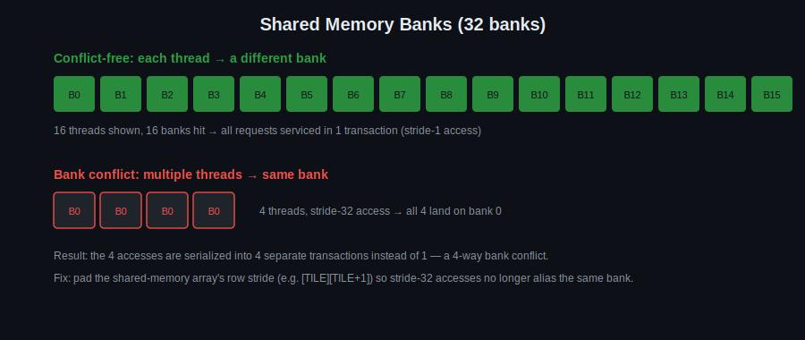

# Day 5: Memory Conflicts and Shared Memory

## Objectives
- Understand shared memory banking and how bank conflicts happen
- Correctly synchronize reads/writes to shared memory (`__syncthreads()`)
- Distinguish global, shared, constant, and pitched memory and when to use each
- Implement a shared-memory tiled filter
- Load/display real images and video with OpenCV, and process them via `cv::cuda::GpuMat`

## Key Concepts
- Bank conflicts
- Sync read/write in kernel
- Global memory
- Shared memory
- Constant memory
- Pitched memory
- `cv::cuda::GpuMat`, `cv::imread`, `cv::VideoCapture`, `cv::imshow`

## Visual

Shared memory is split into 32 banks so that 32 threads can be serviced in one transaction — but only if each thread hits a different bank. Stride-32 access patterns (common when indexing by a tile width that's a multiple of 32) collapse onto the same bank and get serialized. Padding the row stride by one element is the standard fix, and it's exactly what `tiled_filter` in [`template.cu`](template.cu) is set up for.

## OpenCV Basics
Starting today, day templates load real images/video through OpenCV instead of filling synthetic buffers by hand. Four things to know:

- **`cv::imread(path, flags)`** — loads an image file into a host-side `cv::Mat`. `cv::IMREAD_GRAYSCALE` gives you a single-channel `unsigned char` image, the simplest thing to feed a kernel.
- **`cv::VideoCapture`** — `cv::VideoCapture cap(path_or_device_index); cv::Mat frame; cap >> frame;` pulls one frame at a time from a video file or camera, in a loop. This is what Day 5's "video stream" final task and Day 6/13's transform tasks are built around.
- **`cv::imshow("window name", mat)` + `cv::waitKey(ms)`** — displays a `cv::Mat` in a window. `waitKey` isn't optional decoration: it pumps the GUI event loop, so nothing actually paints on screen without it. `waitKey(0)` waits for a keypress; `waitKey(1)` is what you want inside a video loop so playback doesn't stall.
- **`cv::cuda::GpuMat`** — the device-side counterpart of `cv::Mat`. `gpuMat.upload(hostMat)` / `gpuMat.download(hostMat)` copy data across the host/device link (Day 1's PCIe/NVLink picture). Critically, a `GpuMat`'s rows are **pitched**, exactly like `cudaMallocPitch` from [`examples/matrix_add.cu`](../examples/matrix_add.cu): `gpuMat.step` is the row stride in bytes, and it's normally larger than `cols * elemSize()` for alignment. Every kernel that touches a `GpuMat` directly has to index rows by `step`, not by `width` — get this wrong and you'll read garbage past the end of narrow images.

Build note: you'll need OpenCV built with its CUDA module (`opencv_cudaarithm`, `opencv_cudaimgproc`, `opencv_highgui`, `opencv_videoio`). With pkg-config: `` `pkg-config --cflags --libs opencv4` ``.

## Resources
http://homepages.math.uic.edu/~jan/mcs572f16/mcs572notes/lec35.html

Task reference: https://developer.download.nvidia.com/compute/DevZone/C/html_x64/3_Imaging/convolutionSeparable/doc/convolutionSeparable.pdf

## Reference Implementation
[`examples/matrix_add.cu`](../examples/matrix_add.cu) at the repo root uses `cudaMallocPitch` / `cudaMemcpy2D` — a working example of pitched memory referenced in this day's material, and the same pitch idea `GpuMat::step` is built on.

## Hands-On Task
Use shared memory for a 2D filter, loaded from a real image via `cv::imread`. Final task: 2D Sobel filter implementation on a video stream via `cv::VideoCapture`.

## Self-Learning
1. Implement a shared-memory tile-based 2D convolution filter (start with a simple box blur) operating on a `cv::cuda::GpuMat` loaded from a real image.
2. Deliberately create a shared-memory access pattern with bank conflicts, measure the perf hit, then fix it with padding.
3. Implement a 2D Sobel filter using shared memory.
4. Extend the Sobel filter to process a video stream frame by frame using `cv::VideoCapture`, displaying the result with `cv::imshow` each frame.

## Self-Check
No answers given — these are for you to reason through, or discuss with a classmate/instructor.

1. Why do 32 threads reading `tile[threadIdx.x][k]` for a fixed `k` all collide on the same shared-memory bank?
2. Why does `GpuMat::step` differ from `cols * elemSize()`, and what breaks in a kernel that ignores that and assumes rows are contiguous?
3. What does `__syncthreads()` actually guarantee, and what does it explicitly *not* guarantee?

## Code Template
See [`template.cu`](template.cu) for a skeleton to start from.
