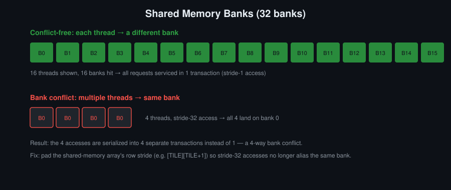

# Day 5: Memory Conflicts and Shared Memory

## Objectives
- Understand shared memory banking and how bank conflicts happen
- Remove conflicts two ways — padding and XOR swizzling — and say which costs what
- Correctly synchronize reads/writes to shared memory (`__syncthreads()`)
- Distinguish global, shared, constant, and pitched memory and when to use each
- Implement a shared-memory tiled filter
- Load/display real images and video with OpenCV, and process them via `cv::cuda::GpuMat`

## Key Concepts
- Bank conflicts
- Conflict avoidance: padding vs. `tile[row][col ^ row]` XOR swizzling
- Sync read/write in kernel
- Global memory
- Shared memory
- Constant memory
- Pitched memory
- `cv::cuda::GpuMat`, `cv::imread`, `cv::VideoCapture`, `cv::imshow`

## Definitions · Սահմանումներ

*Terms introduced today. Same text as the matching entries in [GLOSSARY.md](../GLOSSARY.md).*

**Shared memory** — Չիպի վրա գտնվող հիշողություն, որը հատկացվում է ամեն block-ի համար և հասանելի է block-ի բոլոր thread-երին։ Դրա latency-ն շատ ավելի փոքր է, քան global memory-ինը, իսկ կյանքի տևողությունը համընկնում է block-ի կյանքի տևողությանը։ Հայտարարվում է `__shared__`-ով՝ ստատիկ, կամ չափը տրվում է launch-ի երրորդ արգումենտով՝ դինամիկ։

**Bank** — Shared memory-ի 32 հավասար մասերից մեկը։ Հաջորդական 32-բիթանոց բառերը գտնվում են հաջորդական bank-երում, և ամեն bank մեկ ցիկլում սպասարկում է մեկ բառ։

**Bank conflict** — Իրավիճակ, երբ warp-ի մի քանի thread մեկ դիմումում կարդում կամ գրում են նույն bank-ի տարբեր բառեր։ Այդ դիմումները սպասարկվում են հերթով, ոչ թե զուգահեռ։ Լուծվում է padding-ով (այս օրը) կամ ինդեքսների swizzling-ով (Օր 6)։

**Broadcast** — Երբ warp-ի մի քանի կամ բոլոր lane-երը կարդում են shared memory-ի նույն բառը, hardware-ն այն տալիս է բոլորին մեկ transaction-ով։ Սա conflict չէ։

**N-way conflict** — Երբ warp-ի N lane դիմում են նույն bank-ի N տարբեր բառի, դիմումը բաժանվում է N transaction-ի։

**`__syncthreads()`** — Block-ի barrier։ Ոչ մի thread չի անցնում այս կետը, քանի դեռ block-ի բոլոր thread-երը չեն հասել դրան։ Մինչև barrier-ը կատարված shared և global memory-ի գրառումները barrier-ից հետո տեսանելի են block-ի բոլոր thread-երին։ Քանի որ block-ի ամեն thread պետք է հասնի barrier-ին, այն divergent control flow-ի ներսում դնելը undefined behaviour է։

**Barrier** — Ծրագրի կետ, որին պետք է հասնեն բոլոր մասնակից thread-երը, մինչև դրանցից որևէ մեկը շարունակի։ `__syncthreads()`-ը block-ի barrier-ն է, `__syncwarp`-ը՝ warp-ի barrier-ը։

**Constant memory** — 64 ԿԲ ծավալով տիրույթ, որը նախատեսված է միայն կարդալու համար։ Հայտարարվում է `__constant__`-ով և cache է արվում ամեն SM-ում։ Երբ warp-ի բոլոր lane-երը կարդում են նույն հասցեն, դիմումը սպասարկվում է մեկ broadcast-ով, իսկ տարբեր հասցեները սպասարկվում են հերթով։

**Tiling** — Տվյալների մի հատվածը մեկ անգամ բեռնել shared memory և այնտեղից կարդալ շատ անգամ։ Global memory-ի տրաֆիկը նվազում է մոտավորապես այնքան անգամ, քանի անգամ կրկին օգտագործվում է ամեն տարրը։ Այս տեխնիկան ընկած է tiled matrix multiply-ի և այս դասընթացի բոլոր stencil և ֆիլտր kernel-ների հիմքում։

**Halo** — Եզրային տարրեր, որոնք անհրաժեշտ են tile-ը մշակելու համար, բայց պատկանում են հարևան tile-երին։ R շառավղով ֆիլտրի դեպքում դրանք tile-ի ամեն կողմից R տող կամ սյուն են։ Halo-ն պետք է բեռնվի shared memory tile-ի հետ միասին։

**Pitch** — 2D հատկացման երկու հարևան տողերի սկզբների միջև հեռավորությունը բայթերով (`cudaMallocPitch`)։ Սովորաբար այն մեծ է `width * elementSize`-ից, քանի որ տողերը լրացվում են հավասարեցման (alignment) համար։ Pitched հիշողության հետ աշխատող kernel-ը տողի հասցեն պետք է հաշվի pitch-ով, ոչ թե width-ով։

## Functions · Ֆունկցիաներ

*Interfaces introduced today. Full consolidated list in [API.md](../API.md); concepts in [GLOSSARY.md](../GLOSSARY.md).*

```c
// Հատկացնում է height տող՝ ամեն մեկը width բայթ։ Տողերի իրական քայլը գրվում է *pitch-ում
cudaError_t cudaMallocPitch(void **devPtr, size_t *pitch, size_t width, size_t height);

// Պատճենում է height տող՝ ամեն տողից width բայթ։ dpitch-ը և spitch-ը dst-ի և src-ի տողերի քայլերն են
cudaError_t cudaMemcpy2D(void *dst, size_t dpitch, const void *src, size_t spitch,
                         size_t width, size_t height, enum cudaMemcpyKind kind);

// Block-ի և warp-ի barrier-ներ
void __syncthreads(void);
void __syncwarp(unsigned mask = 0xFFFFFFFF);
```

## Visual


Shared memory is split into 32 banks so that 32 threads can be serviced in one transaction — but only if each thread hits a different bank. Stride-32 access patterns (common when indexing by a tile width that's a multiple of 32) collapse onto the same bank and get serialized. Padding the row stride by one element is the standard fix, and it's exactly what `tiled_filter` in [`template.cu`](template.cu) is set up for.

## Animated


One wire per lane, showing which bank it actually lands on. **Every extra wire arriving at the same bank is one more serialized transaction** — the bank can only serve one word per cycle, so the whole warp waits for the busiest one. Watch the wires stay parallel at stride 1, converge in pairs at stride 2, in fours at stride 4, then funnel entirely into bank 0 at stride 32.

The rule behind it: lane `t` reads word `t × stride`, which lives in bank `(t × stride) mod 32`, so the conflict degree is exactly **`gcd(stride, 32)`**. Two consequences worth internalizing:

- *Every odd stride is conflict-free.* Stride 3, 7, 17 and 31 cost one transaction, identical to stride 1 — the wires cross wildly but never collide. Only strides sharing a factor of two with 32 hurt, and each extra factor doubles the damage. Padding a tile to `[TILE][TILE+1]` is nothing more cunning than forcing an even row stride to become odd.
- *From a stride, the degree is always a power of two.* `gcd(s, 32)` divides 32, so 1, 2, 4, 8, 16, 32 are the only possibilities — there is no such thing as a 3-way conflict from a constant stride. Odd degrees are real, but they need an **irregular** pattern: an indirect gather `s[idx[t]]`, a lookup table, a compaction. That's the fifth phase in the diagram, and the practical difference is how you diagnose them: for a regular tiled kernel, checking `gcd(row_stride, 32)` on paper tells you everything; for a gather, only the profiler can (`ncu --metrics l1tex__data_bank_conflicts_pipe_lsu_mem_shared`).

For a configurable version — set any stride 1–33 or dial in any gather degree, hover a lane to trace its wire, and step through the transpose read/write phases under all three layouts (plain, padded, swizzled) — see [`bank_conflict_animations.html`](bank_conflict_animations.html), open locally in a browser since GitHub's file viewer only shows HTML as source rather than running it. The transpose tab is the concrete setup for Day 12's `transpose_shared` kernel.

## Avoiding Conflicts: Padding vs. XOR Swizzling

Both fixes do the same thing — break the alignment between a logical column and a physical bank — and the quickest way to see how is to print the bank each element lands in.

Take a `__shared__ float tile[32][32]`. Element `(r, c)` sits at word index `32r + c`, so its bank is `(32r + c) mod 32` = **`c`**. The row drops out of the arithmetic entirely, which is the whole problem: *every* row puts logical column `c` in bank `c`.

**No fix — `tile[r][c]`, bank = `c`**

| | c0 | c1 | c2 | c3 | c4 | c5 | c6 | c7 |
|---|---|---|---|---|---|---|---|---|
| **r0** | 0 | 1 | 2 | 3 | 4 | 5 | 6 | 7 |
| **r1** | 0 | 1 | 2 | 3 | 4 | 5 | 6 | 7 |
| **r2** | 0 | 1 | 2 | 3 | 4 | 5 | 6 | 7 |
| **r3** | 0 | 1 | 2 | 3 | 4 | 5 | 6 | 7 |
| **r4** | 0 | 1 | 2 | 3 | 4 | 5 | 6 | 7 |
| **r5** | 0 | 1 | 2 | 3 | 4 | 5 | 6 | 7 |
| **r6** | 0 | 1 | 2 | 3 | 4 | 5 | 6 | 7 |
| **r7** | 0 | 1 | 2 | 3 | 4 | 5 | 6 | 7 |

Read **across** a row and you sweep banks 0…31 — perfect. Read **down** a column and every one of the 32 lanes hits the same bank: a **32-way conflict**, the worst case shared memory has.

**Padding — `tile[32][33]`, bank = `(r + c) mod 32`**

| | c0 | c1 | c2 | c3 | c4 | c5 | c6 | c7 |
|---|---|---|---|---|---|---|---|---|
| **r0** | 0 | 1 | 2 | 3 | 4 | 5 | 6 | 7 |
| **r1** | 1 | 2 | 3 | 4 | 5 | 6 | 7 | 8 |
| **r2** | 2 | 3 | 4 | 5 | 6 | 7 | 8 | 9 |
| **r3** | 3 | 4 | 5 | 6 | 7 | 8 | 9 | 10 |
| **r4** | 4 | 5 | 6 | 7 | 8 | 9 | 10 | 11 |
| **r5** | 5 | 6 | 7 | 8 | 9 | 10 | 11 | 12 |
| **r6** | 6 | 7 | 8 | 9 | 10 | 11 | 12 | 13 |
| **r7** | 7 | 8 | 9 | 10 | 11 | 12 | 13 | 14 |

One wasted column makes the row stride 33 words instead of 32, so each row's banks shift by one. A column now walks diagonally through all 32 banks. You change nothing in the kernel body — only the declaration.

**XOR swizzling — `tile[r][c ^ r]`, bank = `c ^ r`**

| | c0 | c1 | c2 | c3 | c4 | c5 | c6 | c7 |
|---|---|---|---|---|---|---|---|---|
| **r0** | 0 | 1 | 2 | 3 | 4 | 5 | 6 | 7 |
| **r1** | 1 | 0 | 3 | 2 | 5 | 4 | 7 | 6 |
| **r2** | 2 | 3 | 0 | 1 | 6 | 7 | 4 | 5 |
| **r3** | 3 | 2 | 1 | 0 | 7 | 6 | 5 | 4 |
| **r4** | 4 | 5 | 6 | 7 | 0 | 1 | 2 | 3 |
| **r5** | 5 | 4 | 7 | 6 | 1 | 0 | 3 | 2 |
| **r6** | 6 | 7 | 4 | 5 | 2 | 3 | 0 | 1 |
| **r7** | 7 | 6 | 5 | 4 | 3 | 2 | 1 | 0 |

No padding, no extra memory. Every column is conflict-free, and every row is still a permutation of banks 0…31 — so the row access stays perfect too.

Two properties make this safe to do:

- **XOR is its own inverse.** `(c ^ r) ^ r == c`, so applying the same formula on the write and on the read lands you back on the element you meant. There is no "unswizzle" step.
- **It only permutes, never collides.** For a fixed row, `c ^ r` is a bijection on `0…31` — the row still holds all 32 columns, just reordered. Nothing is lost or overwritten.

### Which to use

| | **Padding** `[32][33]` | **Swizzling** `[r][c ^ r]` |
|---|---|---|
| Extra shared memory | One column per row (128 B for a 32×32 float tile) | **None** |
| Kernel changes | Declaration only — body untouched | Every access, read **and** write |
| Easy to get wrong | Hard | Easy: miss one access and you read the wrong element, silently |
| Needs a power-of-two row width | No | **Yes** — see below |
| Survives vectorized (`float4`) access | No | Yes |
| Occupancy impact | Slightly worse (more shared memory per block) | None |

**Start with padding.** It is one character, it cannot be half-applied, and for most tiled kernels the wasted column is irrelevant. Reach for swizzling when shared memory is the resource limiting your occupancy, or when you are loading `float4` and padding has stopped working.

The power-of-two caveat is the one that bites: `c ^ r` is a clean permutation only when the row width is a power of two. A `[18][18]` tile — which is what `TILE_DIM + 2*RADIUS` gives you at `TILE_DIM = 16, RADIUS = 1` — does **not** satisfy that, and the XOR will alias. Either swizzle only the inner power-of-two region, or round the row width up to 32 and mask the index. Day 13 works through exactly this on `tiled_filter_swizzled`.

The **Transpose** tab of [`bank_conflict_animations.html`](bank_conflict_animations.html) lets you flip between all three layouts above and watch the transaction count change from 32 to 1.

## OpenCV Basics
Starting today, day templates load real images/video through OpenCV instead of filling synthetic buffers by hand. Four things to know:

- **`cv::imread(path, flags)`** — loads an image file into a host-side `cv::Mat`. `cv::IMREAD_GRAYSCALE` gives you a single-channel `unsigned char` image, the simplest thing to feed a kernel.
- **`cv::VideoCapture`** — `cv::VideoCapture cap(path_or_device_index); cv::Mat frame; cap >> frame;` pulls one frame at a time from a video file or camera, in a loop. This is what Day 5's "video stream" final task and Day 6/13's transform tasks are built around.
- **`cv::imshow("window name", mat)` + `cv::waitKey(ms)`** — displays a `cv::Mat` in a window. `waitKey` isn't optional decoration: it pumps the GUI event loop, so nothing actually paints on screen without it. `waitKey(0)` waits for a keypress; `waitKey(1)` is what you want inside a video loop so playback doesn't stall.
- **`cv::cuda::GpuMat`** — the device-side counterpart of `cv::Mat`. `gpuMat.upload(hostMat)` / `gpuMat.download(hostMat)` copy data across the host/device link (Day 1's PCIe/NVLink picture). Critically, a `GpuMat`'s rows are **pitched**, exactly like `cudaMallocPitch` from [`examples/matrix_add.cu`](../examples/matrix_add.cu): `gpuMat.step` is the row stride in bytes, and it's normally larger than `cols * elemSize()` for alignment. Every kernel that touches a `GpuMat` directly has to index rows by `step`, not by `width` — get this wrong and you'll read garbage past the end of narrow images.

Build note: you'll need OpenCV built with its CUDA module (`opencv_cudaarithm`, `opencv_cudaimgproc`, `opencv_highgui`, `opencv_videoio`). With pkg-config: `` `pkg-config --cflags --libs opencv4` ``.

## Resources
- [CUDA C Programming Guide](https://docs.nvidia.com/cuda/cuda-programming-guide/) — *Shared Memory* and *Compute Capabilities* (the per-architecture bank layout)
- [Using Shared Memory in CUDA C/C++](https://developer.nvidia.com/blog/using-shared-memory-cuda-cc/) — NVIDIA's own walkthrough, including the padding fix
- [CUDA C++ Best Practices Guide](https://docs.nvidia.com/cuda/cuda-c-best-practices-guide/) — *Shared Memory and Memory Banks*

Task reference: [separable convolution](https://developer.download.nvidia.com/compute/DevZone/C/html_x64/3_Imaging/convolutionSeparable/doc/convolutionSeparable.pdf) (NVIDIA sample write-up)

## Reference Implementation
[`examples/matrix_add.cu`](../examples/matrix_add.cu) at the repo root uses `cudaMallocPitch` / `cudaMemcpy2D` — a working example of pitched memory referenced in this day's material, and the same pitch idea `GpuMat::step` is built on.

## Hands-On Task
Use shared memory for a 2D filter, loaded from a real image via `cv::imread`. Final task: 2D Sobel filter implementation on a video stream via `cv::VideoCapture`.

## Self-Learning
1. Implement a shared-memory tile-based 2D convolution filter (start with a simple box blur) operating on a `cv::cuda::GpuMat` loaded from a real image.
2. Deliberately create a shared-memory access pattern with bank conflicts, measure the perf hit, then fix it with padding.
2b. Fix the same kernel a second way, with `tile[row][col ^ row]` on both the write and the read. Confirm it gives identical output to the padded version, then compare shared-memory usage with `nvcc -Xptxas -v` and conflict counts with `ncu --metrics l1tex__data_bank_conflicts_pipe_lsu_mem_shared.sum`.
3. Implement a 2D Sobel filter using shared memory.
4. Extend the Sobel filter to process a video stream frame by frame using `cv::VideoCapture`, displaying the result with `cv::imshow` each frame.

## Self-Check
No answers given — these are for you to reason through, or discuss with a classmate/instructor.

1. Why do 32 threads reading `tile[threadIdx.x][k]` for a fixed `k` all collide on the same shared-memory bank?
1b. A warp accesses shared memory with stride 3. How many transactions does it cost, and why isn't the answer 3? (Then check yourself against the stride explorer in [`bank_conflict_animations.html`](bank_conflict_animations.html).)
1c. For a `tile[32][32]` of floats, element `(r, c)` lands in bank `c` — the row cancels out. Show the arithmetic, then redo it for `tile[32][33]` and explain where the `r` reappears.
1d. Why does swizzling need no "unswizzle" pass on the way out, while almost any other index remapping would?
2. Why does `GpuMat::step` differ from `cols * elemSize()`, and what breaks in a kernel that ignores that and assumes rows are contiguous?
3. What does `__syncthreads()` actually guarantee, and what does it explicitly *not* guarantee?

## Code Template
See [`template.cu`](template.cu) for a skeleton to start from.

No CUDA GPU on your machine? Run this lab in the [course Colab notebook](https://colab.research.google.com/drive/1zDtYkz8WwD7sOIucSyUoxm2n7RYWJxVZ?usp=sharing) instead — free T4, compute capability 7.5, which is exactly the `-arch=sm_75` the template compiles for. One caveat for this day: Colab's preinstalled OpenCV is CPU-only, so `cv::cuda::GpuMat` will not link. Either build OpenCV with `-DWITH_CUDA=ON` in the notebook, or swap the image I/O for a `cudaMalloc` buffer and a synthetic image — the CUDA content of this day is unchanged either way. Full setup in the [root README](../README.md#-no-cuda-gpu-start-here).
