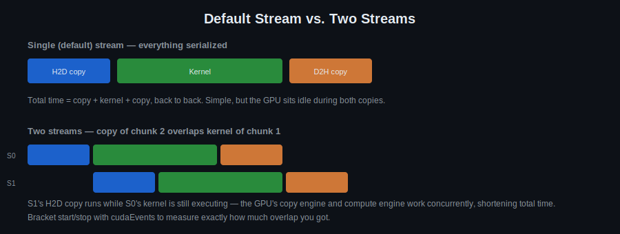

# Day 6: Streams and Events

## Objectives
- Consolidate the first five days: threads/blocks/grids, memory types, bank conflicts
- Introduce CUDA streams and events
- Use `cudaEvent`s for precise device-side timing (first formal use — earlier days used host-side `<chrono>` on purpose)
- Implement image derivative, shared-memory convolution, and transform kernels on a real image loaded via OpenCV

## Key Concepts
- SIMD arch
- Threads/Blocks/Grids
- Global/local/shared/constant memory
- Page locked/pinned memory
- Pitched memory
- DDR and depth: https://depletionmode.com/ram-mapping.html
- Bank conflicts in shared memory
- Streams/events

## Visual

The default stream runs everything strictly in order — the GPU sits idle during both copies. Once you use two (or more) streams, the copy engine and the compute engine can work at the same time, so one stream's transfer overlaps another stream's kernel. `cudaEvent`s are how you measure exactly how much time that overlap actually saves.

## Resources
https://www.cse.iitd.ac.in/~rijurekha/col730_2022/cudastreams_aug25_aug29.pdf
https://developer.download.nvidia.com/CUDA/training/StreamsAndConcurrencyWebinar.pdf
https://on-demand.gputechconf.com/gtc/2014/presentations/S4158-cuda-streams-best-practices-common-pitfalls.pdf

## Hands-On Task
- Implement image derivatives, on a real image loaded via `cv::imread` and uploaded to `cv::cuda::GpuMat` (see [`template.cu`](template.cu))
- Implement convolution via shared memory
- Implement image transform

## Self-Learning
1. Implement an image derivative (gradient) kernel — compute dx/dy per pixel. `dx`/`dy` are float `GpuMat`s in the template; `cv::normalize` (or take the absolute value and scale) before `cv::imshow`, or the result will look black.
2. Implement convolution via shared memory (reuse your Day 5 tiling approach).
3. Implement a simple image transform (e.g. rotate or scale) kernel.
4. Time each kernel precisely with `cudaEvent`s (`cudaEventCreate` / `cudaEventRecord` / `cudaEventElapsedTime`) and compare against your earlier `<chrono>` measurements.
5. (Stretch) Split the derivative + transform work across two CUDA streams and check whether they overlap.

## Self-Check
No answers given — these are for you to reason through, or discuss with a classmate/instructor.

1. Why does the default stream serialize operations even when they don't depend on each other?
2. What would go wrong if you called `cudaEventElapsedTime()` right after `cudaEventRecord(stop)`, without `cudaEventSynchronize(stop)` first?
3. Why do the `dx`/`dy` gradient outputs need `cv::normalize` (or similar) before `cv::imshow`, when the filtered image from Day 5 didn't?

## Code Template
See [`template.cu`](template.cu) for a skeleton to start from.
