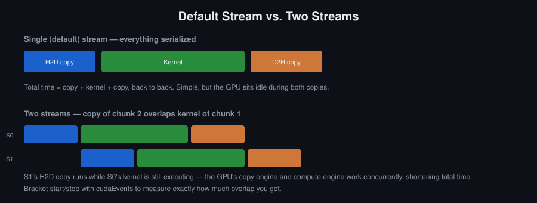

# Day 6: Streams and Events

## Objectives
- Consolidate the first five days: threads/blocks/grids, memory types, bank conflicts
- Introduce CUDA streams and events
- Use `cudaEvent`s for precise device-side timing (first formal use — earlier days used host-side `<chrono>` on purpose)
- Enqueue host code into a stream with `cudaLaunchHostFunc`, and explain why it must not call any CUDA API
- Implement image derivative, shared-memory convolution, and transform kernels on a real image loaded via OpenCV

## Key Concepts
- SIMD arch
- Threads/Blocks/Grids
- Global/local/shared/constant memory
- Page locked/pinned memory
- Pitched memory
- DDR and depth: https://depletionmode.com/ram-mapping.html
- Bank conflicts in shared memory
- Streams/events
- Host functions in a stream (`cudaLaunchHostFunc`)

## Visual


The default stream runs everything strictly in order — the GPU sits idle during both copies. Once you use two (or more) streams, the copy engine and the compute engine can work at the same time, so one stream's transfer overlaps another stream's kernel. `cudaEvent`s are how you measure exactly how much time that overlap actually saves.

## Host Functions: running CPU code *inside* a stream

Events tell you when GPU work finished, but only if the host asks — `cudaEventSynchronize` blocks, `cudaEventQuery` polls. Sometimes you want the opposite: enqueue a piece of **host** code into the stream so it runs by itself once the preceding work completes, with no host thread waiting around.

```c++
// cudaHostFn_t is: void CUDART_CB fn(void *userData)
void CUDART_CB on_chunk_done(void *userData)
{
    auto *ctx = static_cast<chunk_ctx *>(userData);
    printf("chunk %d ready\n", ctx->index);   // host work only
}

cudaMemcpyAsync(d_in, h_in, n, cudaMemcpyHostToDevice, stream);
process<<<grid, block, 0, stream>>>(d_in, d_out, n);
cudaMemcpyAsync(h_out, d_out, n, cudaMemcpyDeviceToHost, stream);

CUDA_CHECK(cudaLaunchHostFunc(stream, on_chunk_done, &ctx));   // runs after the copy-out
```

The call returns immediately. The function itself runs later, on a driver-internal thread, after everything already queued in that stream has completed.

### The rule that makes this dangerous

**The host function must not make any CUDA API call.** Not `cudaMalloc`, not a kernel launch, not `cudaMemcpyAsync`, not `cudaStreamSynchronize` — nothing. The documentation is explicit that attempting one *may* return `cudaErrorNotPermitted`, "but this is not required." In other words the failure mode is undefined behaviour or a deadlock, not a tidy error code you can check.

That restriction is less arbitrary than it looks. Your function is running *as* a stream operation, on a driver thread, in the middle of the driver's own bookkeeping. Calling back into the driver from there is re-entrancy, and asking it to wait on GPU work would be asking the stream to wait on itself.

Three more properties worth knowing before you use one:

- **It blocks the rest of the stream.** Work enqueued after the host function does not start until the function returns. A slow callback stalls the GPU, which is the opposite of what you came to Day 6 for. Keep it to a flag, a counter, a `printf`, or a push onto a lock-free queue.
- **Order across streams is undefined.** Host functions in independent streams may run in any order, and may be serialized against each other.
- **It does not run if the context has errored.** So it is a completion notification, not an error handler — report failures through `CUDA_CHECK` on the host side as usual.

### Why this belongs on the streams day

A host function is **capturable**: during `cudaStreamBeginCapture` / `cudaStreamEndCapture` it becomes a host node in the graph. That means a whole pipeline — copy in, kernel, copy out, notify the host — can be recorded once and replayed as a single CUDA graph on Day 12, with the notification still firing at the right point in the sequence. Without it, the "tell me when this chunk is done" step would have to live outside the graph, and the pipeline could never be captured as one unit.

## Resources
https://www.cse.iitd.ac.in/~rijurekha/col730_2022/cudastreams_aug25_aug29.pdf
https://developer.download.nvidia.com/CUDA/training/StreamsAndConcurrencyWebinar.pdf
https://on-demand.gputechconf.com/gtc/2014/presentations/S4158-cuda-streams-best-practices-common-pitfalls.pdf

## Hands-On Task
- Implement image derivatives, on a real image loaded via `cv::imread` and uploaded to `cv::cuda::GpuMat` (see [`template.cu`](template.cu))
- Implement convolution via shared memory
- Implement image transform

## Self-Learning
1. Implement an image derivative (gradient) kernel — compute dx/dy per pixel. `dx`/`dy` are float `GpuMat`s in the template; `cv::normalize` (or take the absolute value and scale) before `cv::imshow`, or the result will look black.
2. Implement convolution via shared memory (reuse your Day 5 tiling approach).
3. Implement a simple image transform (e.g. rotate or scale) kernel.
4. Time each kernel precisely with `cudaEvent`s (`cudaEventCreate` / `cudaEventRecord` / `cudaEventElapsedTime`) and compare against your earlier `<chrono>` measurements.
5. (Stretch) Split the derivative + transform work across two CUDA streams and check whether they overlap.
6. Enqueue a `cudaLaunchHostFunc` after the copy-out that prints a message, and confirm from the ordering of your `printf`s that it runs *after* the GPU work rather than at the point you called it.
7. Put a `sleep` of a few hundred milliseconds inside that host function and time the stream again. Explain the slowdown in terms of "the host function blocks work added after it".
8. Call `cudaMalloc` (or any CUDA API) from inside the host function. Does it return `cudaErrorNotPermitted`, hang, or appear to work? Note what you observed — the documentation permits all three.

## Self-Check
No answers given — these are for you to reason through, or discuss with a classmate/instructor.

1. Why does the default stream serialize operations even when they don't depend on each other?
2. What would go wrong if you called `cudaEventElapsedTime()` right after `cudaEventRecord(stop)`, without `cudaEventSynchronize(stop)` first?
3. Why do the `dx`/`dy` gradient outputs need `cv::normalize` (or similar) before `cv::imshow`, when the filtered image from Day 5 didn't?
4. `cudaLaunchHostFunc` returns immediately, but the function it enqueues runs much later. What decides *when*?
5. Why is a host function forbidden from calling into the CUDA API at all? Think about which thread it runs on and what it would be asking the driver to do.
6. A host function does not run if the context has errored. What does that tell you about where error handling belongs in a streamed pipeline?

## Code Template
See [`template.cu`](template.cu) for a skeleton to start from.

No CUDA GPU on your machine? Run this lab in the [course Colab notebook](https://colab.research.google.com/drive/1zDtYkz8WwD7sOIucSyUoxm2n7RYWJxVZ?usp=sharing) instead — free T4, compute capability 7.5, which is exactly the `-arch=sm_75` the template compiles for. One caveat for this day: Colab's preinstalled OpenCV is CPU-only, so `cv::cuda::GpuMat` will not link. Either build OpenCV with `-DWITH_CUDA=ON` in the notebook, or swap the image I/O for a `cudaMalloc` buffer and a synthetic image — the CUDA content of this day is unchanged either way. Full setup in the [root README](../README.md#-no-cuda-gpu-start-here).
