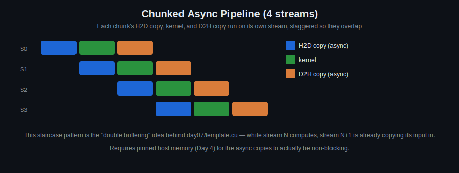

# Day 7: Asynchronous Execution Techniques

## Objectives
- Distinguish synchronous vs. asynchronous `cudaMemcpy`
- Launch kernels asynchronously and reason about stream dependencies
- Use events for cross-stream timing and synchronization
- Practice on exam-scope problems (see below)

## Key Concepts
- `cudaMemcpy`: sync vs async
- Async kernel launches
- Stream dependencies
- Event-based timing

## Visual

This is the "double buffering" pattern that `day07/template.cu` is built around: split your data into chunks, put each chunk's copy-in/compute/copy-out on its own stream, and issue them so consecutive chunks overlap. It only works if the host buffers are pinned (Day 4) — otherwise `cudaMemcpyAsync` silently falls back to synchronous behavior.

## Hands-On Task
Image transform (continued from Day 6, now with async memory transfers).

## Examination Practice Tasks
Larger, exam-scope problems — pick a few to work through over the week, not just today:

- `cdist` implementation
- Compute vector mean and std (for large Ns), compare with CPU version
- Implement Sobel filter (and/or Canny edge detection) + histogram on HOG
- Implement dilation and erosion filters
- Optimize one of OpenCV's 1D/2D filters
- Matrix multiplication
- Image zoom (based on textures — see Day 11)
- DFT, N = 32

## Self-Learning
Smaller-scoped exercises to build toward the examination tasks above:

1. Overlap an async H2D copy with kernel execution using two streams and `cudaMemcpyAsync`; use events to confirm the overlap.
2. Compute vector mean and standard deviation for a large array on the GPU, compare against a CPU implementation.
3. Implement image dilation and/or erosion filters.
4. Implement a small (e.g. 32x32) matrix multiplication kernel as a warm-up for the examination task.

## Code Template
See [`template.cu`](template.cu) for a skeleton to start from.
