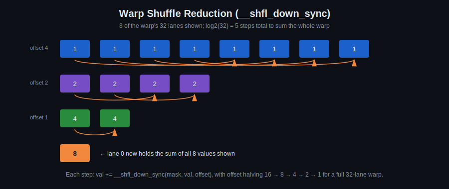

# Day 8: Warp-Level Intrinsics – Reduction

## Objectives
- Understand warp shuffle functions and intra-warp communication
- Implement warp-level parallel reduction
- Reason about performance tuning at the warp level

## Key Concepts
- Warp shuffle functions
- Intra-warp communication
- Parallel reduction
- Performance tuning

## Visual

`__shfl_down_sync` lets a lane read a value directly from another lane's register — no shared memory, no `__syncthreads()`. Halving the offset each step (16 → 8 → 4 → 2 → 1 for a full warp) sums all 32 values in just 5 steps, with lane 0 ending up holding the result.

## Animated

Same 8-lane fragment, three different intrinsics: `__shfl_down_sync` and `__shfl_up_sync` shift values one direction or the other by a fixed offset; `__shfl_xor_sync` exchanges values between paired lanes (`i` and `i^mask`), which is what makes it useful for butterfly-style reductions and the FFT stretch task below — every lane both sends and receives in one instruction, instead of the one-directional shift of up/down.

## Resources
https://people.maths.ox.ac.uk/~gilesm/cuda/lecs/lec4.pdf

https://tschmidt23.github.io/cse599i/CSE%20599%20I%20Accelerated%20Computing%20-%20Programming%20GPUs%20Lecture%2018.pdf

https://developer.nvidia.com/blog/using-cuda-warp-level-primitives/

## Hands-On Task
32-order FFT; extract indices of a real image (loaded via `cv::imread` into a `cv::cuda::GpuMat`) above a threshold, using warp scan.

## Self-Learning
1. Implement warp-level sum reduction using `__shfl_down_sync`.
2. Implement a simple parallel prefix sum (scan) within a single warp.
3. Use the scan result to extract (compact) the indices of pixels above a threshold, from a real `GpuMat`-backed image (see Part 2 of [`template.cu`](template.cu)).
4. (Stretch) Implement a 32-point FFT butterfly using warp shuffles.

## Self-Check
No answers given — these are for you to reason through, or discuss with a classmate/instructor.

1. Why doesn't `__shfl_down_sync` need `__syncthreads()` the way shared-memory code does?
2. After the 5 steps of `warp_reduce_sum`, why is lane 0 specifically guaranteed to hold the correct total (and not, say, lane 16)?
3. Why is extracting the indices of pixels above a threshold naturally suited to a scan (prefix sum) rather than a simple sequential filter loop?

## Code Template
See [`template.cu`](template.cu) for a skeleton to start from.
