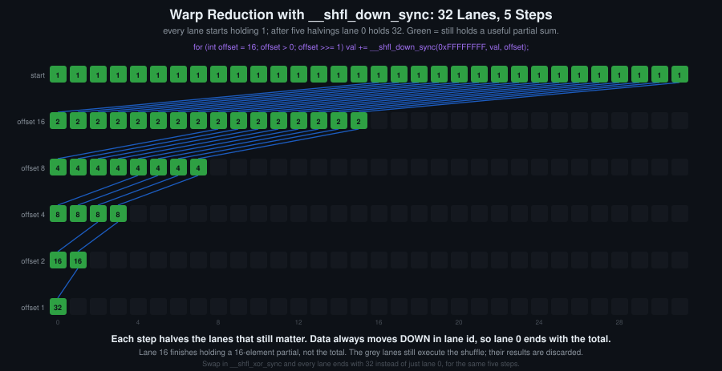
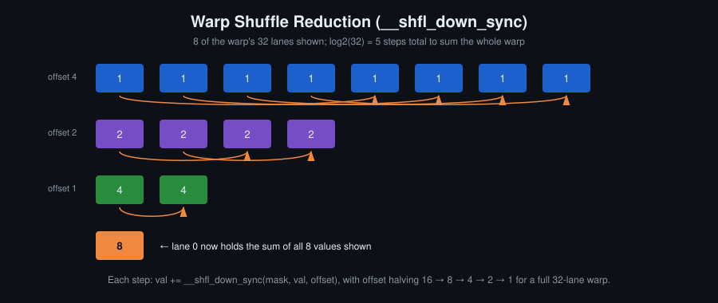

# Day 8: Warp-Level Intrinsics – Reduction

## Objectives
- Understand warp shuffle functions and intra-warp communication
- Explain what the lane mask asserts, and why calling a `_sync` intrinsic inside a divergent branch is undefined behaviour rather than merely slow
- Implement warp-level parallel reduction, and extend it to a whole block via the hierarchical warp → shared → warp pattern
- Implement an inclusive warp scan, and use `__ballot_sync` + `__popc` as the cheaper route for binary predicates
- Explain why register shuffles beat a shared-memory reduction, and where that stops being true

## Key Concepts
- Warp shuffle functions: `__shfl_down_sync`, `__shfl_up_sync`, `__shfl_xor_sync`, `__shfl_sync`
- The lane mask, divergence, and identity values for out-of-range lanes
- Intra-warp communication without shared memory or barriers
- Parallel reduction: warp-level, then block-level (hierarchical)
- Inclusive scan (Kogge-Stone) and stream compaction
- Warp-aggregated atomics: one `atomicAdd` per warp instead of one per element
- Performance tuning: shuffles vs. shared memory

## Visual

### The full warp: 32 lanes, 5 steps



The whole reduction at real warp width. Every lane starts with `1`; after five halvings lane 0 holds `32`. Three things the picture makes concrete that the loop body doesn't:

- **The lanes that still matter halve every step.** By the last step 31 of 32 lanes are contributing nothing. That looks wasteful and isn't — they cost no extra instructions, because the warp issues the shuffle for all 32 lanes whether or not the results are used.
- **Data only ever moves down in lane id.** That is the whole reason lane 0 is the one holding the answer, and why lane 16 ends up with a 16-element partial rather than the total.
- **Five steps, not 31.** log₂(32) = 5. A sequential sum of 32 values takes 31 additions; this takes 5 instructions.

### All four shuffles


Each line runs from the lane a value is **read from** down to the lane that receives it. The four intrinsics differ only in how that source is computed:

| Intrinsic | lane `i` reads from | shape |
|---|---|---|
| `__shfl_sync(m, v, n)` | lane `n` | every line converges on one lane — a broadcast |
| `__shfl_up_sync(m, v, d)` | lane `i - d` | parallel shift toward higher lanes; lanes `< d` keep their own value |
| `__shfl_down_sync(m, v, d)` | lane `i + d` | parallel shift toward lower lanes; lanes `≥ 32-d` keep their own value |
| `__shfl_xor_sync(m, v, k)` | lane `i ^ k` | butterfly — lines cross in pairs, every lane both sends and receives |

The "keeps their own value" cases are the ones to notice: a lane whose computed source falls outside 0–31 gets its own value back rather than garbage. That's precisely why the reduction loop above needs no bounds check.

`__shfl_xor_sync` is the odd one out in a useful way. Because the exchange is symmetric, running the reduction with it leaves *every* lane holding the total instead of just lane 0 — same five steps, same cost, no broadcast needed afterwards. That's what makes it the right choice for the FFT butterfly in the stretch task, and for any case where all 32 lanes need the result to continue.

<details>
<summary>The original 8-lane diagrams (easier to trace by hand)</summary>





Same mechanics on an 8-lane fragment, animated. Useful for following a single value through the steps before looking at all 32 at once.

</details>

## Code Walkthrough

### The mask is a promise, not boilerplate

Every `_sync` intrinsic takes a lane mask as its first argument, and `0xFFFFFFFF` — the one you'll see everywhere — asserts *all 32 lanes of this warp will reach this instruction*. It isn't a formality. Since Volta, lanes in a warp have independent program counters, so they genuinely can sit at different instructions. If you promise 32 participants and only 20 arrive, the result is undefined behaviour: not a wrong number you can debug, but a hang or garbage that changes between runs and GPUs.

This is the trap, and it looks completely reasonable:

```c++
// BROKEN: lanes with id >= n never reach the shuffle, but the mask claims they do
int id = blockIdx.x * blockDim.x + threadIdx.x;
if (id < n) {
    int val = in[id];
    val = warp_reduce_sum(val);   // <-- divergent: only some lanes are here
}
```

The fix is to keep every lane in the warp executing the reduction and neutralize the out-of-range ones with an identity value instead:

```c++
// CORRECT: all 32 lanes participate; the ones past the end contribute 0
int id = blockIdx.x * blockDim.x + threadIdx.x;
int val = (id < n) ? in[id] : 0;    // 0 is the identity for +
val = warp_reduce_sum(val);
```

Note the identity has to match the operation — `0` for sum, `1` for product, `INT_MIN` for max. This is exactly the Day 3 divergence lesson with sharper teeth: there, divergence cost you performance; here it costs you correctness.

`__activemask()` tells you which lanes are *actually* present, but it's a diagnostic, not a fix — restructuring so the intrinsic sits outside the branch is almost always the right answer.

### Warp reduction, step by step

```c++
__device__ int warp_reduce_sum(int val)
{
    for (int offset = 16; offset > 0; offset >>= 1) {
        val += __shfl_down_sync(0xFFFFFFFF, val, offset);
    }
    return val;   // lane 0 holds the total
}
```

Five iterations, halving each time. Take 32 lanes each holding `1`:

| offset | what happens | lanes holding useful partials |
|---|---|---|
| 16 | lane `i` adds lane `i+16`'s value | 0–15 hold 2 each |
| 8 | lane `i` adds lane `i+8`'s value | 0–7 hold 4 each |
| 4 | | 0–3 hold 8 each |
| 2 | | 0–1 hold 16 each |
| 1 | lane 0 adds lane 1's value | **lane 0 holds 32** |

Two details that look like bugs and aren't:

- **No bounds check on the source lane.** When lane 20 asks for lane 36, the source is out of range and the intrinsic simply returns lane 20's *own* value. Those lanes are past the useful half of the reduction and their results are discarded, so the garbage never propagates. That's why the loop needs no guard.
- **Lane 0, specifically.** `shfl_down` always moves data toward lower lane IDs, so the total accumulates downward. Lane 16 holds a partial sum of 16 elements at the end, not the total — the answer to Self-Check 2.

If you need the result in *every* lane rather than just lane 0, swap the intrinsic:

```c++
for (int offset = 16; offset > 0; offset >>= 1)
    val += __shfl_xor_sync(0xFFFFFFFF, val, offset);   // butterfly: all lanes end up with the sum
```

Same five steps, same cost, no broadcast needed afterwards. That's the `warp_shuffle_intrinsics.svg` animation above made useful.

### From warp to block: the level this course was missing

A warp reduction gives you one value per warp. A 256-thread block has 8 of them, and you need the 8 combined. The idiomatic answer is hierarchical — reduce within each warp, park the partials in shared memory, then reduce those with a *single* warp:

```c++
__device__ int block_reduce_sum(int val)
{
    __shared__ int warp_sums[32];          // 32 warps max per block (1024 threads)

    const int lane = threadIdx.x & 31;     // valid: blockDim.x is a multiple of 32
    const int wid  = threadIdx.x >> 5;

    val = warp_reduce_sum(val);            // 1. each warp reduces itself
    if (lane == 0) warp_sums[wid] = val;   // 2. one write per warp, no contention
    __syncthreads();                       // 3. the only barrier in the whole thing

    const int nwarps = blockDim.x >> 5;
    val = (threadIdx.x < nwarps) ? warp_sums[lane] : 0;
    if (wid == 0) val = warp_reduce_sum(val);   // 4. first warp finishes the job

    return val;                            // thread 0 holds the block total
}
```

Compare that to the classic shared-memory tree reduction, which for 256 threads needs 8 rounds of shared-memory traffic and **8 `__syncthreads()`**. This version needs 32 bytes of shared memory and **one** barrier. Everything else is register-to-register.

Two levels is all you ever need: 32 lanes collapse to 1, and at most 32 warps collapse to 1, which covers the 1024-thread maximum exactly. That's not a coincidence — it's why the warp is 32 wide.

To reduce a whole grid, have thread 0 of each block `atomicAdd` its block total (this is Day 9's privatization, arrived at from the other direction), or write per-block partials and launch a second small kernel.

### Warp scan (inclusive)

Reduction collapses 32 values into 1. A **scan** keeps all 32, replacing each with the running total up to and including itself — `[1,1,1,1,…]` becomes `[1,2,3,4,…]`.

```c++
__device__ int warp_scan_inclusive(int val)
{
    const int lane = threadIdx.x & 31;
    for (int offset = 1; offset < 32; offset <<= 1) {
        const int n = __shfl_up_sync(0xFFFFFFFF, val, offset);
        if (lane >= offset) val += n;      // the guard is load-bearing
    }
    return val;
}
```

This is the Kogge-Stone algorithm: 5 steps, same as the reduction. The `lane >= offset` guard is the part to understand — lanes below `offset` are asking for a source lane that doesn't exist, so they get their own value back, and adding it would silently double their own contribution. Unlike the reduction, those lanes' results are *not* discarded, so here the guard genuinely matters.

`lane = threadIdx.x & 31` is only the lane ID when `blockDim.x` is a multiple of 32. For a 2D block like `dim3(32, 8)` it still works because `blockDim.x` is exactly 32; for `dim3(16, 16)` it silently doesn't. Flatten first if you're unsure — see [INTRINSICS.md](../INTRINSICS.md#thread--lane-identity).

### Stream compaction, and the shortcut that beats scan

Task 3 asks you to compact the indices of pixels above a threshold. Scan is the textbook route: each passing lane needs to know how many lanes *before* it also passed, which is exactly an exclusive prefix sum over a 0/1 predicate.

But for a binary predicate there's a two-instruction shortcut, and it's what production code uses:

```c++
const int  lane = threadIdx.x & 31;
const bool keep = (pixel > threshold);

const unsigned ballot = __ballot_sync(0xFFFFFFFF, keep);   // one bit per lane
const int prefix = __popc(ballot & ((1u << lane) - 1));    // how many before me passed
const int total  = __popc(ballot);                         // how many in total

int base;
if (lane == 0) base = atomicAdd(out_count, total);         // ONE atomic per warp
base = __shfl_sync(0xFFFFFFFF, base, 0);                   // broadcast lane 0's result

if (keep) out_indices[base + prefix] = my_index;
```

`__ballot_sync` packs all 32 predicates into one integer, `__popc` counts the set bits below your lane, and the whole 5-step scan collapses into two instructions. The `atomicAdd` runs once per warp instead of once per passing pixel — up to 32× less contention, the same aggregation idea Day 9 formalizes.

The mask `(1u << lane) - 1` clears bit `lane` and everything above it, leaving only lanes strictly below you — an *exclusive* prefix, which is what you want since your own slot shouldn't be counted before you write to it. It's correct at `lane == 31` too: `(1u << 31) - 1` is `0x7FFFFFFF`.

### Or don't write it at all: `cub::WarpReduce`

Everything above is worth understanding, and in production code you will often still reach for the library version. CUB ships with the toolkit and has a warp reduction already tuned per architecture:

```c++
#include <cub/cub.cuh>

#ifdef NDEBUG
    typedef cub::WarpReduce<int> WarpReduceT;

    __shared__ typename WarpReduceT::TempStorage temp_storage;
    const auto result = WarpReduceT(temp_storage).Sum(r);
#else
    // In a debug build the CUB path costs far more registers and shared memory,
    // which can drop occupancy enough to change what you're measuring. The
    // hand-written butterfly is cheap in every build.
    int result = r;
#pragma unroll
    for (int i = 1; i < 32; i *= 2) {
        result += __shfl_xor_sync(0xFFFFFFFF, result, i);
    }
#endif
```


Three things this snippet is actually teaching:

- **The `#else` branch is the butterfly from above**, written out. `__shfl_xor_sync` with `i` doubling from 1 to 16 is the same five steps, and every lane finishes holding the sum — which is why no broadcast follows it.
- **CUB needs `__shared__` scratch; the shuffle version needs none.** That's the real difference between the two branches. `WarpReduceT::TempStorage` is a per-warp shared-memory allocation, and shared memory is an occupancy resource (Day 2). The comment in the original is blunt about it: in a debug build, where nothing is inlined and registers aren't reused, that cost is high enough to distort a measurement.
- **`#pragma unroll` on a 5-iteration compile-time loop** is Day 3 material doing real work here: it removes the loop entirely so the five shuffles issue back to back.

When to use which: reach for CUB when you want a reduction and don't care how it's done — it handles types, operators other than sum, and partial warps, and it will track future architectures. Write the shuffle by hand when you need to fuse the reduction into something else, when you're avoiding the shared-memory footprint, or when you're learning what the library is doing. `cub::BlockReduce` is the drop-in for `block_reduce_sum` above, and Day 14 covers the libraries properly.

### Why any of this beats shared memory

`__shfl_*_sync` compiles to a single `SHFL` instruction (see [ARCHITECTURE.md](../ARCHITECTURE.md#from-cc-to-sass-instruction-reference)) that moves data directly between registers in the same warp. Concretely, against a shared-memory reduction:

- **No shared memory consumed**, so nothing competes with your tiles for the SM's SRAM budget and occupancy doesn't drop (Day 2).
- **No `__syncthreads()`.** A warp is already in lockstep; there's nothing to synchronize.
- **No memory instruction at all** — not even the `LDS`/`STS` a shared-memory version issues, and no bank conflicts to think about (Day 5).

The catch is the one in the name: it only works *within* a warp. Crossing warp boundaries needs shared memory, which is exactly what `block_reduce_sum` above uses it for — once, for 32 values, instead of on every step.

## Resources
https://people.maths.ox.ac.uk/~gilesm/cuda/lecs/lec4.pdf

https://tschmidt23.github.io/cse599i/CSE%20599%20I%20Accelerated%20Computing%20-%20Programming%20GPUs%20Lecture%2018.pdf

https://developer.nvidia.com/blog/using-cuda-warp-level-primitives/

## Hands-On Task
32-order FFT; extract indices of a real image (loaded via `cv::imread` into a `cv::cuda::GpuMat`) above a threshold, using warp scan.

## Self-Learning
1. Implement warp-level sum reduction using `__shfl_down_sync`. Verify it against a host loop for `n = 1024` filled with 1s — the answer must be exactly `n`.
2. Implement a simple parallel prefix sum (scan) within a single warp.
3. Use the scan result to extract (compact) the indices of pixels above a threshold, from a real `GpuMat`-backed image (see Part 2 of [`template.cu`](template.cu)).
4. Extend the warp reduction to a full `block_reduce_sum` using the warp → shared → warp pattern above, then reduce the whole grid by having thread 0 of each block `atomicAdd` its total. Compare against a classic shared-memory tree reduction: count the `__syncthreads()` calls in each and time both.
5. Rewrite `warp_reduce_sum` with `__shfl_xor_sync` so every lane ends up with the total, and confirm the timing is unchanged. When would you want this version?
6. Redo task 3 with `__ballot_sync` + `__popc` instead of the scan, with one warp-aggregated `atomicAdd` per warp. Time both against an image where ~5% of pixels pass, and again where ~95% do.
7. Write the divergence bug on purpose: call `warp_reduce_sum` inside `if (id < n)` with an `n` that isn't a multiple of 32. Does it give the wrong answer, hang, or appear to work? Try it under `compute-sanitizer --tool synccheck` (Day 1), then fix it with the identity-value approach.
8. Replace your `warp_reduce_sum` with `cub::WarpReduce<int>` and confirm the same answer. Then compile both a debug and a release build with `-Xptxas -v` and compare register and shared-memory usage — the `#ifdef NDEBUG` in the walkthrough above exists because of what you'll see.
9. (Stretch) Implement a 32-point FFT butterfly using warp shuffles.

## Self-Check
No answers given — these are for you to reason through, or discuss with a classmate/instructor.

1. Why doesn't `__shfl_down_sync` need `__syncthreads()` the way shared-memory code does?
2. After the 5 steps of `warp_reduce_sum`, why is lane 0 specifically guaranteed to hold the correct total (and not, say, lane 16)?
3. Why is extracting the indices of pixels above a threshold naturally suited to a scan (prefix sum) rather than a simple sequential filter loop?
4. The reduction needs no bounds check on its source lane, but the scan needs `if (lane >= offset)`. What's different about the two situations?
5. Passing `0xFFFFFFFF` when only some lanes reach the instruction is undefined behaviour. Why is "it produced the right answer on my GPU" not evidence that the code is correct?
6. `block_reduce_sum` uses exactly one `__syncthreads()`. Where is it, and what would break if you removed it?
7. Why does a two-level hierarchy (warp, then warps-within-a-block) suffice for any legal block size? What property of the number 32 makes that work?
8. In the `__ballot_sync` compaction, why must lane 0's `atomicAdd` result be broadcast with `__shfl_sync` rather than each lane calling `atomicAdd` itself?

## Code Template
See [`template.cu`](template.cu) for a skeleton to start from.

No CUDA GPU on your machine? Run this lab in the [course Colab notebook](https://colab.research.google.com/drive/1zDtYkz8WwD7sOIucSyUoxm2n7RYWJxVZ?usp=sharing) instead — free T4, compute capability 7.5, which is exactly the `-arch=sm_75` the template compiles for. One caveat for this day: Colab's preinstalled OpenCV is CPU-only, so `cv::cuda::GpuMat` will not link. Either build OpenCV with `-DWITH_CUDA=ON` in the notebook, or swap the image I/O for a `cudaMalloc` buffer and a synthetic image — the CUDA content of this day is unchanged either way. Full setup in the [root README](../README.md#-no-cuda-gpu-start-here).
