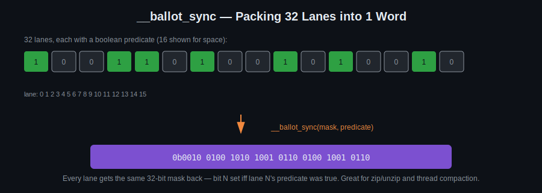

# Day 9: Warp-Level Data Exchange

## Objectives
- Use `__syncwarp`, `__activemask`, and `__ballot_sync` correctly
- Combine warp reduction with atomic operations
- Implement warp-level bit packing/unpacking

## Key Concepts
Warp level programming and `__syncwarp`, `__activemask`, `__ballot_sync`.

## Visual

`__ballot_sync` turns "which lanes satisfy this condition?" into a single 32-bit integer that every lane in the warp receives — bit N set iff lane N's predicate was true. That mask is exactly what you need for this day's zip/unzip task, and it's the building block `__activemask`/`__syncwarp` use internally to know which lanes are still participating.

## Resources
https://developer.nvidia.com/blog/using-cuda-warp-level-primitives/

## Hands-On Task
- Calculate image mean (use warp reduction and `atomicAdd`, maybe exchange?)
- `pyrUp`/`pyrDown` functions (https://docs.opencv.org/4.x/d4/d1f/tutorial_pyramids.html)
- Zip/Unzip binary images by 32x (warp level)

## Self-Learning
1. Compute an image's mean pixel value using warp-level reduction, then `atomicAdd` the per-warp partial sums into a single global accumulator.
2. Use `__ballot_sync` to pack 32 binary pixel values into one 32-bit word, and write the inverse (unzip) operation.
3. Implement `pyrDown` (blur + downsample by 2).
4. Implement `pyrUp` (upsample by 2 + blur).

## Code Template
See [`template.cu`](template.cu) for a skeleton to start from.
