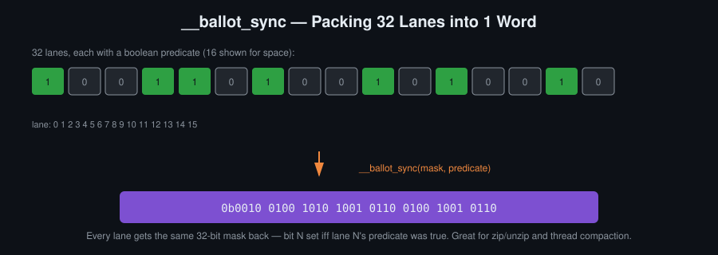

# Day 9: Warp-Level Data Exchange

## Objectives
- Use `__syncwarp`, `__activemask`, and `__ballot_sync` correctly
- Combine warp reduction with atomic operations
- Explain why atomic contention serializes, and apply privatization to break it up
- Implement warp-level bit packing/unpacking

## Key Concepts
Warp level programming and `__syncwarp`, `__activemask`, `__ballot_sync`.
Atomics, contention, and privatization.

## Visual


`__ballot_sync` turns "which lanes satisfy this condition?" into a single 32-bit integer that every lane in the warp receives — bit N set iff lane N's predicate was true. That mask is exactly what you need for this day's zip/unzip task, and it's the building block `__activemask`/`__syncwarp` use internally to know which lanes are still participating.

## Privatization

Today's mean-pixel task ends with `atomicAdd` into a single global accumulator, and that raises the question this section answers: what happens when *every* thread wants to update the same address?

They serialize. Atomics are resolved at L2, not at the SM that issued them (see [ARCHITECTURE.md](../ARCHITECTURE.md)), so every request to a given address funnels through the same L2 slice and queues there — regardless of how many SMs are working. Launch a million threads all hammering one counter and you have built an extremely expensive sequential program.

**Privatization** is the standard fix: give each block its own private copy in shared memory, let contention play out locally where it's cheap, and merge once at the end. A histogram makes the accounting concrete:

```c++
__global__ void histogram_private(const unsigned char *in, int n, unsigned int *bins)
{
    __shared__ unsigned int local[256];

    // 1. zero the private copy (256 bins, blockDim.x threads -> strided loop)
    for (int i = threadIdx.x; i < 256; i += blockDim.x) local[i] = 0;
    __syncthreads();

    // 2. accumulate privately. Contention is now confined to one block, and
    //    shared-memory atomics are far cheaper than global ones.
    int idx = blockIdx.x * blockDim.x + threadIdx.x;
    int stride = gridDim.x * blockDim.x;             // grid-stride, Day 2
    for (int i = idx; i < n; i += stride) atomicAdd(&local[in[i]], 1);
    __syncthreads();

    // 3. merge: 256 global atomics per block, instead of one per input element
    for (int i = threadIdx.x; i < 256; i += blockDim.x) {
        if (local[i]) atomicAdd(&bins[i], local[i]);
    }
}
```

Count the global atomics. The naive version issues one per input element — for a 4K image, 8.3 million. The privatized version issues `256 × numBlocks`; at 1000 blocks that's 256 thousand, a 30× reduction in traffic to the contended resource. The arithmetic performed is identical.

**You have already built the warp-level version of this.** Day 8's `__shfl_down_sync` reduction followed by one `atomicAdd` from lane 0 *is* privatization — the private copy just lives in registers instead of shared memory, and there are 32 lanes rather than a whole block. Privatization is that pattern generalized beyond sum reduction to any accumulator. `__match_any_sync` ([INTRINSICS.md](../INTRINSICS.md)) extends it to the keyed case, letting lanes that happen to share a bin aggregate before touching memory at all.

Two practical notes:

- `atomicAdd_block()` is a block-scoped atomic — cheaper than the device-wide default because it only needs coherence within the block. Use it on shared-memory accumulators.
- Privatization is a fix for **contention**, and it isn't free: you pay for zeroing, two `__syncthreads()`, and the merge. If your output array is large and keys are well spread, contention is already low and privatization just adds overhead. Measure before reaching for it.

See [PERFORMANCE.md §5](../PERFORMANCE.md#5-privatization) for where this sits among the other optimizations.

## Resources
https://developer.nvidia.com/blog/using-cuda-warp-level-primitives/

## Hands-On Task
- Calculate the mean of a real image, loaded via `cv::imread` into a `cv::cuda::GpuMat` (use warp reduction and `atomicAdd`, maybe exchange?)
- `pyrUp`/`pyrDown` functions (https://docs.opencv.org/4.x/d4/d1f/tutorial_pyramids.html)
- Zip/Unzip binary images by 32x (warp level)

## Self-Learning
1. Compute an image's mean pixel value using warp-level reduction, then `atomicAdd` the per-warp partial sums into a single global accumulator. [`template.cu`](template.cu) loads a real image into a `GpuMat` for this.
2. Use `__ballot_sync` to pack 32 binary pixel values into one 32-bit word, and write the inverse (unzip) operation.
3. Implement `pyrDown` (blur + downsample by 2) on the loaded `GpuMat`, and display the result with `cv::imshow`.
4. Implement `pyrUp` (upsample by 2 + blur).
5. Implement a 256-bin grayscale histogram twice: once with a single global `atomicAdd` per pixel, once privatized into shared memory as above. Time both on a large image and compute the ratio. Then try it on an image that's nearly all one shade — does the gap widen or narrow, and why?
6. Take the privatized histogram and replace the shared-memory `atomicAdd` with `atomicAdd_block`. Measure whether it makes a difference on your GPU.

## Self-Check
No answers given — these are for you to reason through, or discuss with a classmate/instructor.

1. What does the 32-bit mask returned by `__ballot_sync` actually represent, bit by bit?
2. Why does computing an image mean use `atomicAdd` into one global accumulator instead of having each warp write into its own slot of a shared array?
3. Why does `pyrDown` blur before downsampling instead of just keeping every other pixel directly?
4. Privatization adds a zeroing pass, two `__syncthreads()`, and a merge pass. Describe an input distribution where that overhead makes it a net loss.
5. Why is a shared-memory `atomicAdd` cheaper than a global one, given that both serialize when threads collide?

## Code Template
See [`template.cu`](template.cu) for a skeleton to start from.
