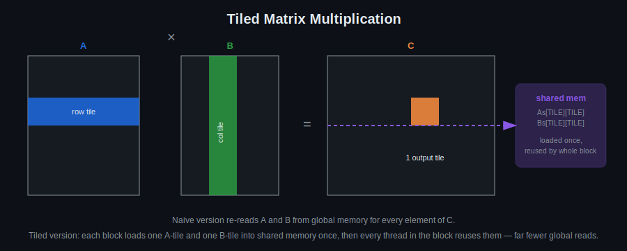

# Day 10: Practical Algorithms

## Objectives
- Implement matrix multiplication on the GPU, naive then tiled
- Implement Hamming-distance descriptor matching
- Compare naive vs. optimized implementations

## Key Concepts
- Descriptor matching based on Hamming distance
- Matrix multiplication

## Visual

The naive kernel re-reads the same rows/columns of A and B from global memory over and over — once per output element. The tiled version loads one tile of each into shared memory per block and lets every thread in the block reuse it, cutting global memory traffic dramatically. This is the same tiling idea from Day 5, applied to matmul instead of a filter.

## Resources
https://www.quantstart.com/articles/Matrix-Matrix-Multiplication-on-the-GPU-with-Nvidia-CUDA/

## Hands-On Task
- Descriptor matching based on Hamming distance — on real ORB descriptors extracted from an image via `cv::cuda::ORB` (see Part 2 of [`template.cu`](template.cu))
- Matrix multiplication (kept as a generic linear-algebra exercise — not every kernel needs to be image-shaped)

## Self-Learning
1. Implement naive GPU matrix multiplication (global memory only).
2. Optimize it using shared-memory tiling (reuse Day 5 tiling patterns) and compare timing against the naive version.
3. Implement Hamming distance between binary descriptors using `__popc`.
4. Batch the Hamming distance computation to find the nearest descriptor match for each query descriptor. The template extracts real ORB descriptors from a loaded image and self-matches them as a sanity check (distance should be 0, match index should be itself) — try it against two *different* images instead.

## Self-Check
No answers given — these are for you to reason through, or discuss with a classmate/instructor.

1. Why does the tiled matmul reduce global memory traffic compared to the naive version, given that both compute the exact same result?
2. Why is `__popc` used for Hamming distance instead of a bit-by-bit comparison loop?
3. The template self-matches a descriptor set against itself as a sanity check. What does a correct result (distance 0, `best_match_idx[i] == i`) actually verify — and what does it *not* verify about `match_descriptors`?

## Code Template
See [`template.cu`](template.cu) for a skeleton to start from.
