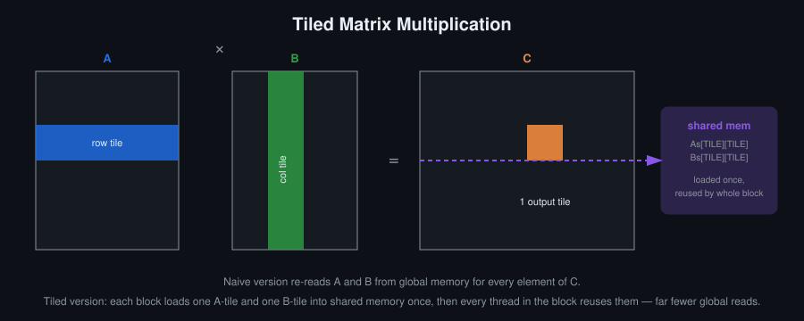

# Day 10: Practical Algorithms

## Objectives
- Implement matrix multiplication on the GPU, naive then tiled
- Implement Hamming-distance descriptor matching
- Compare naive vs. optimized implementations

## Key Concepts
- Descriptor matching based on Hamming distance
- Matrix multiplication

## Visual


The naive kernel re-reads the same rows/columns of A and B from global memory over and over — once per output element. The tiled version loads one tile of each into shared memory per block and lets every thread in the block reuse it, cutting global memory traffic dramatically. This is the same tiling idea from Day 5, applied to matmul instead of a filter.

## Measuring Matmul: TFLOP/s

Matmul is the first kernel in this course that is genuinely *compute*-bound, so bandwidth is the wrong yardstick — the metric here is **TFLOP/s**.

An M×M×M multiply computes M² outputs, each a length-M dot product, so:

```
FLOPs = 2 * M^3          // the 2 is the multiply AND the add
```

Halving that by counting an FMA as one operation is the classic way to accidentally report half your throughput; 2 is the convention cuBLAS is benchmarked with. Converting to TFLOP/s from a millisecond timing collapses neatly:

```c++
#include "../common/timer.h"

kernel_timer_t t;
for (int i = 0; i < 50; ++i) { t.start(); matmul_naive<<<grid, block>>>(d_A, d_B, d_C, n); t.stop(); }
t.report_tflops("matmul_naive", 2.0 * n * n * n);
t.report_tflops("matmul_tiled", 2.0 * n * n * n);   // after task 2
```
```
matmul_naive                4.181 ms      3.21 TFLOP/s  (4% of 82.6 TFLOP/s peak)
matmul_tiled                0.688 ms     19.52 TFLOP/s  (24% of 82.6 TFLOP/s peak)
```

Two things to be careful about: write `2.0 * n * n * n`, not `2 * n * n * n` — the latter is computed in `int` and overflows at n = 1291. And average over many launches; a single timing is mostly noise.

Why tiling wins here is worth stating precisely, because it isn't "shared memory is fast." Both kernels perform *exactly* the same 2n³ operations. The naive version reads each element of A and B n times from global memory; the T×T tiled version reads each n/T times. Tiling didn't speed up the arithmetic — it cut the bytes, raising arithmetic intensity by a factor of T and moving the kernel from the memory-bound part of the roofline to the compute-bound part. See [PERFORMANCE.md](../PERFORMANCE.md) for the general form of that move.

And when your tiled version lands at ~25% of peak, that's the expected result, not a failure: closing the rest of the gap needs register tiling, vectorized loads and eventually tensor cores. It's also why task 67 has you compare against cuBLAS — the honest lesson of this day is knowing when to stop writing your own GEMM.

## Resources
https://www.quantstart.com/articles/Matrix-Matrix-Multiplication-on-the-GPU-with-Nvidia-CUDA/

## Hands-On Task
- Descriptor matching based on Hamming distance — on real ORB descriptors extracted from an image via `cv::cuda::ORB` (see Part 2 of [`template.cu`](template.cu))
- Matrix multiplication (kept as a generic linear-algebra exercise — not every kernel needs to be image-shaped)

## Self-Learning
1. Implement naive GPU matrix multiplication (global memory only).
2. Optimize it using shared-memory tiling (reuse Day 5 tiling patterns) and compare timing against the naive version.
3. Implement Hamming distance between binary descriptors using `__popc`.
4. Batch the Hamming distance computation to find the nearest descriptor match for each query descriptor. The template extracts real ORB descriptors from a loaded image and self-matches them as a sanity check (distance should be 0, match index should be itself) — try it against two *different* images instead.

## Self-Check
No answers given — these are for you to reason through, or discuss with a classmate/instructor.

1. Why does the tiled matmul reduce global memory traffic compared to the naive version, given that both compute the exact same result?
2. Why is `__popc` used for Hamming distance instead of a bit-by-bit comparison loop?
3. The template self-matches a descriptor set against itself as a sanity check. What does a correct result (distance 0, `best_match_idx[i] == i`) actually verify — and what does it *not* verify about `match_descriptors`?

## Code Template
See [`template.cu`](template.cu) for a skeleton to start from.
