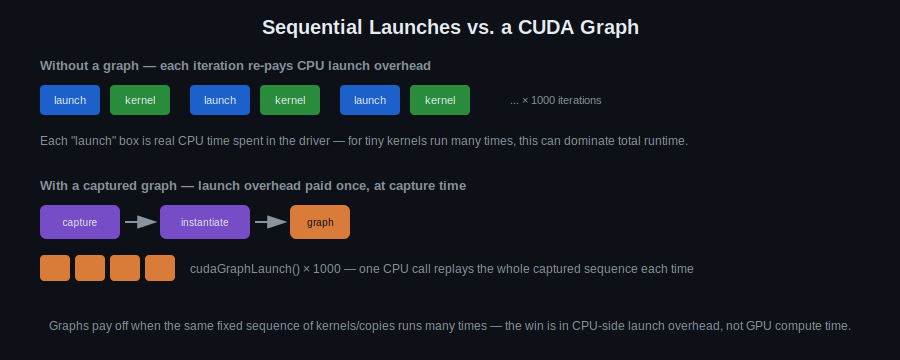

# Day 12: CUDA Graph API

## Objectives
- Capture a sequence of kernel/memory operations into a CUDA graph
- Instantiate and launch a captured graph
- Compare matrix transpose via shared memory vs. via texture binding
- Understand when graph launch overhead pays off vs. regular sequential launches

## Key Concepts
- Graph recording
- Kernel + memory op capture
- Graph launch

## Visual


Graphs don't make the GPU compute faster — they cut the CPU-side overhead of re-issuing the same sequence of launches over and over. The win shows up when you run the same fixed pipeline many times (self-learning task 4 below is designed to make that overhead visible).

## Resources
https://www.olcf.ornl.gov/wp-content/uploads/2021/10/013_CUDA_Graphs.pdf
https://developer.nvidia.com/blog/cuda-graphs/
https://developer.nvidia.com/blog/efficient-matrix-transpose-cuda-cc/

Manual creation reference:
https://github.com/hummingtree/cuda-graph-with-dynamic-parameters/tree/release

## Code Walkthrough
A small RAII wrapper around a captured CUDA graph:

```c++
struct graph_t
{
    graph_creation_status_t m_status = UNINITIALIZED;
    cudaGraph_t m_graph = nullptr;
    cudaGraphExec_t m_instance = nullptr;

    ~graph_t()
    {
        if (m_graph) {
            cudaGraphDestroy(m_graph);
            m_graph = nullptr;
        }
        if (m_instance) {
            cudaGraphExecDestroy(m_instance);
            m_instance = nullptr;
        }
    }

    inline void launch(cv::cuda::Stream &stream)
    {
        CV_Assert(nullptr != m_instance);
        cudaGraphLaunch(m_instance, cv::cuda::custream(stream));
    }

    inline bool is_created() const { return GRAPH_CRATED == m_status; }
    inline bool is_initiaized() const { return INITIALIZED == m_status; }
    inline bool is_uninitiaized() const { return UNINITIALIZED == m_status; }
    inline void set_initiaized() { m_status = INITIALIZED; }

    static inline void start_capture(cv::cuda::Stream &stream) {
        cudaStreamBeginCapture(cv::cuda::custream(stream), cudaStreamCaptureModeGlobal);
    }

    inline void create_graph(cv::cuda::Stream &stream)
    {
        CV_Assert(nullptr == m_instance);
        CV_Assert(nullptr == m_graph);
        CV_Assert(INITIALIZED == m_status);
        cudaStreamEndCapture(cv::cuda::custream(stream), &m_graph);
        cudaGraphInstantiate(&m_instance, m_graph, NULL, NULL, 0);
        m_status = GRAPH_CRATED;
    }
};
```

## Hands-On Task
Matrix transpose via shared memory, compared with an implementation using texture binding.

## Self-Learning
1. Implement matrix transpose using shared memory (watch for bank conflicts — pad the tile).
2. Implement matrix transpose using texture binding (reuse Day 11), compare performance.
3. Capture a small multi-kernel pipeline (e.g. transpose + a second kernel) into a CUDA graph via stream capture, then instantiate and launch it.
4. Launch the captured graph many times in a loop and compare total time against launching the same kernels sequentially without a graph — measure where the launch-overhead savings start to matter.

## Code Template
See [`template.cu`](template.cu) for a skeleton to start from.
