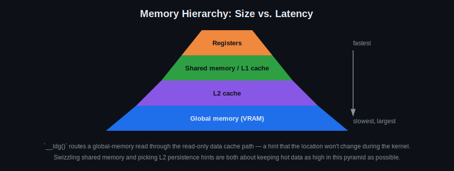

# Day 13: Cache Behavior and Optimization

## Objectives
- Deepen understanding of shared-memory bank conflicts and how to remove them
- Understand L1/L2 cache behavior and persistence hints
- Use `__ldg` to hint read-only global memory access
- Apply the week's techniques to optimize a real kernel

## Key Concepts
- Bank conflicts
- Using L2 cache
- Persistent cache for compiled programs and configuration
- `__ldg` forces the compiler to consider memory read-only

## Visual

Every optimization this day is about the same idea: keep frequently-read data as high in this pyramid as possible, for as long as possible. `__ldg()`, shared-memory swizzling, and L2 persistence hints are three different tools for the same goal.

![XOR swizzling: an 8x8 shared-memory tile where accessing logical column 3 without swizzling always hits bank 3 for every row, but indexing with tile[row][col ^ row] spreads that same logical column across a different bank on every row, with no padding column needed](swizzling.svg)

Padding (Day 5) fixes bank conflicts by wasting a column so the row stride is no longer a multiple of the bank count. Swizzling fixes the same problem without wasting any memory: index shared memory as `tile[row][col ^ row]` instead of `tile[row][col]`. Because XOR is its own inverse, writing and reading with the same swizzle formula is still correct — you just physically scatter each logical column across every bank instead of pinning it to one.

For the hardware behind this pyramid — why shared memory and L1 are the same physical SRAM, why L2 is shared across every SM instead of being per-SM like L1, and where atomic operations actually get resolved — see [ARCHITECTURE.md](../ARCHITECTURE.md).

## Resources
https://developer.nvidia.com/blog/using-shared-memory-cuda-cc/

https://cuda-programming.blogspot.com/2013/02/bank-conflicts-in-shared-memory-in-cuda.html

Shared memory swizzling reference:
https://leimao.github.io/images/blog/2024-05-14-CUDA-Shared-Memory-Swizzling/swizzling.png

## Hands-On Task
Optimize transform (the Day 6 image transform kernel), on a real image loaded via `cv::imread` / `cv::cuda::GpuMat`.

## Self-Learning
1. Add `__ldg()` to a read-heavy kernel from an earlier day (e.g. the Day 5 tiled filter) and measure the effect.
2. Fill in `tiled_filter_swizzled` in [`template.cu`](template.cu): use `tile[row][col ^ row]` (both `[TILE_DIM][TILE_DIM]`, no padding column) for every shared-memory read and write, and compare its timing against the padded Day 5 version.
3. Experiment with L2 persistence hints (`cudaAccessPolicyWindow`) on a buffer that's read repeatedly across kernel launches.
4. Optimize the Day 6 image transform kernel using everything from this week (shared memory, texture, `__ldg`, bank-conflict-free layout) and document before/after timings.

## Self-Check
No answers given — these are for you to reason through, or discuss with a classmate/instructor.

1. Why does `__ldg` only help for data the kernel treats as read-only?
2. Why does `col ^ row` swizzling need the row width to be a power of two to cleanly avoid bank conflicts?
3. What's the tradeoff L2 persistence hints (`cudaAccessPolicyWindow`) are making — and when could they make performance *worse* instead of better?

## Code Template
See [`template.cu`](template.cu) for a skeleton to start from.
