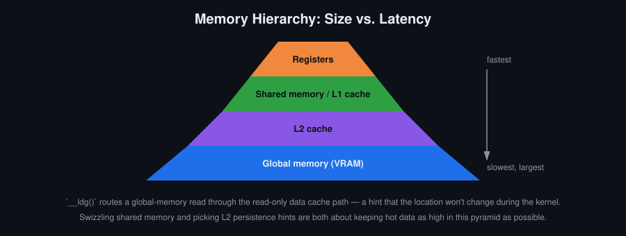
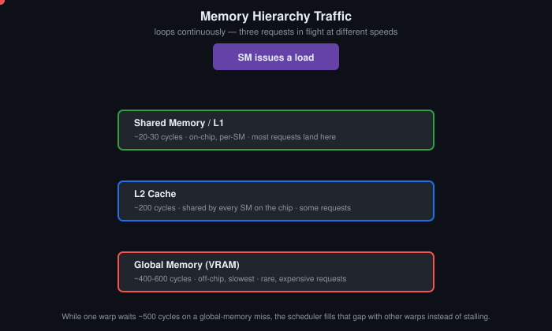
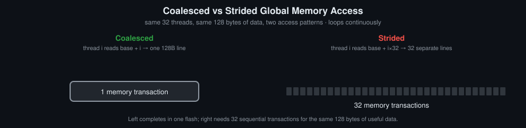

# Day 13: Cache Behavior and Optimization

## Objectives
- Deepen understanding of shared-memory bank conflicts and how to remove them
- Understand L1/L2 cache behavior and persistence hints
- Use `__ldg` to hint read-only global memory access
- Understand LRU cache eviction and how to bias it with per-instruction cache operators
- Amortize per-thread fixed costs with thread coarsening, and see why it trades against occupancy
- Express a kernel's speed as a percentage of theoretical peak bandwidth, and use it to decide when to stop
- Apply the week's techniques to optimize a real kernel

## Key Concepts
- Bank conflicts
- Using L2 cache
- Persistent cache for compiled programs and configuration
- `__ldg` forces the compiler to consider memory read-only
- LRU cache eviction, and per-instruction cache hints (`__ldcs`, `__stcs`, `__ldlu`, ...)
- Thread coarsening
- Memory-bound vs. compute-bound; achieved bandwidth as a fraction of peak

## Visual


Every optimization this day is about the same idea: keep frequently-read data as high in this pyramid as possible, for as long as possible. `__ldg()`, shared-memory swizzling, and L2 persistence hints are three different tools for the same goal.

![XOR swizzling: an 8x8 shared-memory tile where accessing logical column 3 without swizzling always hits bank 3 for every row, but indexing with tile[row][col ^ row] spreads that same logical column across a different bank on every row, with no padding column needed](swizzling.svg)

Padding (Day 5) fixes bank conflicts by wasting a column so the row stride is no longer a multiple of the bank count. Swizzling fixes the same problem without wasting any memory: index shared memory as `tile[row][col ^ row]` instead of `tile[row][col]`. Because XOR is its own inverse, writing and reading with the same swizzle formula is still correct — you just physically scatter each logical column across every bank instead of pinning it to one.

For the hardware behind this pyramid — why shared memory and L1 are the same physical SRAM, why L2 is shared across every SM instead of being per-SM like L1, and where atomic operations actually get resolved — see [ARCHITECTURE.md](../ARCHITECTURE.md).

## Animated


Most traffic resolves fast, close to the SM (green, ~1s round trip); some reaches L2 (blue, ~3s); a rare few pay the full global-memory round trip (red, ~6s). Same pyramid as `cache_hierarchy.svg`, now showing where requests actually land.



For a fully interactive, playable version (fire requests on demand, step through) see [`memory_animations.html`](memory_animations.html) — open it locally in a browser, since GitHub's file viewer only shows HTML as source rather than running it.

## LRU and Per-Instruction Cache Hints
L1 and L2 are both finite, so when full, something gets evicted to make room for a new line. The hardware's replacement policy is an approximation of **LRU (Least Recently Used)**: evict whichever line hasn't been touched in the longest time. `cudaAccessPolicyWindow` (below) biases that policy for a whole buffer at once; there's also a finer-grained tool — per-instruction cache operators — that biases it one load or store at a time:

```c++
float x = __ldcs(&input[i]);   // "streaming" read: touched once, evict-first hint
__stcs(&output[i], result);    // "streaming" write: won't be re-read, don't linger in cache
```

`__ldcs`/`__stcs` are the two you'll reach for most: mark data you're touching exactly once so it doesn't crowd out data your kernel (or a neighboring warp) genuinely reuses. This is a *different* knob from `__ldg()` — `__ldg` changes *which cache* a read uses (the read-only/texture path, Day 11); `__ldcs`/`__stcs` stay on the normal L1/L2 path and change *how eagerly the replacement policy discards the line*. Full intrinsic list (`__ldca`, `__ldcg`, `__ldcs`, `__ldlu`, `__ldcv`, `__stwb`, `__stcg`, `__stcs`, `__stwt`) and PTX mnemonics in [ARCHITECTURE.md](../ARCHITECTURE.md#cache-eviction-hints-lru-and-loadstore-cache-operators).

## Thread Coarsening

Every kernel so far launches one thread per output element. That's the natural default, and it's often too much parallelism.

Each thread re-pays a fixed cost: index arithmetic, bounds checks, the shared-memory tile loads it shares with its neighbours, and its share of block launch overhead. When that fixed cost is a meaningful fraction of the useful work, giving each thread *several* elements amortizes it. That's **thread coarsening**.

The naive way to write it is wrong in an instructive way:

```c++
// BROKEN: thread 0 takes 0-3, thread 1 takes 4-7 -- lanes are now stride-4,
// so you've traded a small overhead win for uncoalesced access (Day 2). Net loss.
int i = (blockIdx.x * blockDim.x + threadIdx.x) * 4;
for (int k = 0; k < 4; ++k) if (i + k < n) out[i + k] = f(in[i + k]);
```

The correct form keeps adjacent lanes on adjacent addresses at every step — which is exactly the grid-stride loop from Day 2:

```c++
int i = blockIdx.x * blockDim.x + threadIdx.x;
int stride = gridDim.x * blockDim.x;
for (int k = i; k < n; k += stride) out[k] = f(in[k]);   // still coalesced
```

So **you already wrote a coarsened kernel on Day 2** without it being named. The knob is the grid size: launch fewer blocks and each thread naturally handles more elements. Try `vector_add_grid_stride` with 64, 256 and 1024 blocks and watch where it peaks.

The bigger win shows up in tiled kernels like this day's `tiled_filter`, where a coarsened thread produces several outputs from *one* set of shared-memory loads:

```
1 output per thread : load tile -> compute 1 result
4 outputs per thread: load tile -> compute 4 results
```

The loads are unchanged, the useful work quadruples. In roofline terms (see below) you've raised arithmetic intensity 4× without touching the algorithm.

**The trade-off is against occupancy.** Each partial result lives in a register, so a coarsened thread needs more of them, and fewer blocks fit per SM. Those two pull in opposite directions, which means this is a knob you *measure* rather than reason about. The usual sweet spot is 2–8 elements per thread; beyond that registers spill to local memory (which is global memory in disguise — see [ARCHITECTURE.md](../ARCHITECTURE.md)) and the gain evaporates. `nvcc -Xptxas -v` reports spills, so it will tell you when you've gone too far.

## Are You Even Memory-Bound? (%-of-peak)

This day times three kernel variants against each other, which answers "which is faster" but not the more useful question: **how much room is left?**

Day 1's `report_device_capabilities()` prints theoretical peak bandwidth. Compute what your kernel actually achieved and divide:

```c++
#include "../common/timer.h"

kernel_timer_t t;
for (int i = 0; i < 100; ++i) { t.start(); tiled_filter_baseline<<<grid, block>>>(...); t.stop(); }
t.report_bandwidth("baseline", 2.0 * width * height);   // one byte in, one byte out
```
```
baseline                    0.087 ms     602.8 GB/s  (84% of 720 GB/s peak)
```

[`common/timer.h`](../common/timer.h) does the arithmetic (and the averaging — a single launch is mostly noise). For a compute-bound kernel like matmul, use `report_tflops()` instead: FLOPs ÷ time, where an M×M×M matmul is `2.0 * M * M * M` operations — the 2 being the multiply *and* the add, which is the convention cuBLAS is benchmarked with.

That one number changes what you do next:

| % of peak | Verdict |
|---|---|
| < 30% | Something structural — check coalescing (Day 2) and occupancy before touching cache hints |
| 50–70% | Normal; the techniques on this page are worth trying |
| > 80% | **Stop.** You're at the hardware limit. `__ldg`, swizzling and cache hints cannot beat the memory bus — the only remaining win is moving fewer bytes |

Add it to the three `printf`s in [`template.cu`](template.cu) and the day stops being "swizzled was 4% faster" and becomes "baseline was already at 84% of peak, so there was never 4× on the table." That's the honest and much more useful conclusion, and it's the discipline behind tasks 94 and 100 in [TASKS.md](../TASKS.md). Full treatment, including arithmetic intensity and where each optimization applies, in [PERFORMANCE.md](../PERFORMANCE.md).

## Resources
https://developer.nvidia.com/blog/using-shared-memory-cuda-cc/

https://cuda-programming.blogspot.com/2013/02/bank-conflicts-in-shared-memory-in-cuda.html

Shared memory swizzling reference:
https://leimao.github.io/images/blog/2024-05-14-CUDA-Shared-Memory-Swizzling/swizzling.png

## Hands-On Task
Optimize transform (the Day 6 image transform kernel), on a real image loaded via `cv::imread` / `cv::cuda::GpuMat`.

## Self-Learning
1. Add `__ldg()` to a read-heavy kernel from an earlier day (e.g. the Day 5 tiled filter) and measure the effect.
2. Fill in `tiled_filter_swizzled` in [`template.cu`](template.cu): use `tile[row][col ^ row]` (both `[TILE_DIM][TILE_DIM]`, no padding column) for every shared-memory read and write, and compare its timing against the padded Day 5 version.
3. Experiment with L2 persistence hints (`cudaAccessPolicyWindow`) on a buffer that's read repeatedly across kernel launches.
4. Optimize the Day 6 image transform kernel using everything from this week (shared memory, texture, `__ldg`, bank-conflict-free layout) and document before/after timings.
5. In one of your filter kernels, write the final output with `__stcs` instead of a plain store (it's written once and never read back inside the kernel), and read the tile's halo region with the default `__ldca` (it's reused by neighboring threads). Measure whether marking the write-once output as streaming changes anything.
6. Add the achieved-bandwidth and %-of-peak calculation to all three `printf`s in [`template.cu`](template.cu). Which variant is closest to peak — and given that number, was there ever as much headroom as the relative timings suggested?
7. Coarsen `tiled_filter_baseline` so each thread computes 2, then 4, then 8 output pixels from the same tile load. Plot time against elements-per-thread and find the peak. Then run `nvcc -Xptxas -v` at each setting and check whether the drop-off coincides with register spilling.
8. Take the Day 2 grid-stride vector add and sweep the grid size (64, 256, 1024, 4096 blocks) with `n` fixed. Explain the shape of the curve in terms of coarsening at one end and occupancy at the other.

## Self-Check
No answers given — these are for you to reason through, or discuss with a classmate/instructor.

1. Why does `__ldg` only help for data the kernel treats as read-only?
2. Why does `col ^ row` swizzling need the row width to be a power of two to cleanly avoid bank conflicts?
3. What's the tradeoff L2 persistence hints (`cudaAccessPolicyWindow`) are making — and when could they make performance *worse* instead of better?
4. Why is the hardware's LRU replacement policy an *approximation* rather than exact LRU, and why does that make cache hints like `__ldcs` useful even when the hardware is "supposed" to figure out reuse patterns on its own?
5. A kernel runs at 88% of theoretical peak bandwidth. Your manager asks for a 2× speedup. What are you allowed to change, and what is definitively off the table?
6. Coarsening raises the work per thread but lowers occupancy. Why isn't there a single right answer, and what property of the kernel decides which way it goes?
7. Why does the "broken" coarsening variant above produce completely correct output while being slower than the uncoarsened kernel it was meant to improve?

## Code Template
See [`template.cu`](template.cu) for a skeleton to start from.
