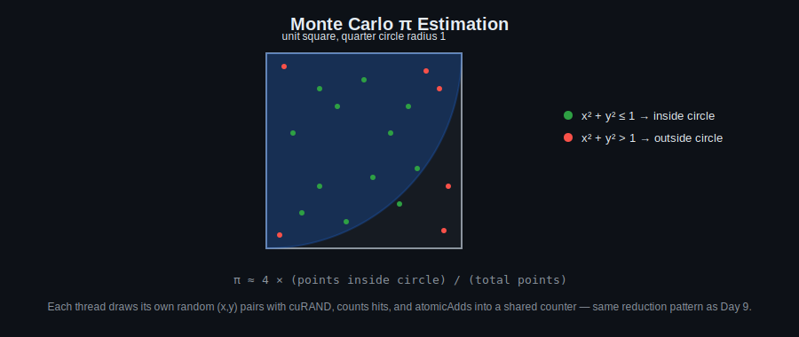

# Day 14: CUDA Libraries

## Objectives
- Use cuRAND to generate random numbers on the device
- Use cuBLAS for basic linear algebra
- Use cuFFT for FFT computation
- Understand recursive/dynamic-parallelism kernel launches at a high level

## Key Concepts
- cuRAND (random generation)
- cuBLAS (linear algebra)
- cuFFT (FFT)
- Monte Carlo π estimation
- CUDA recursive kernel launch (dynamic parallelism)

## Visual

Each thread generates its own stream of random points with cuRAND, tests each one against the circle, and contributes its count toward a shared total — the same warp-reduction + atomicAdd pattern from Day 9, just applied to random sampling instead of image data.

## Hands-On Task
Estimate π using Monte Carlo sampling with cuRAND.

## Self-Learning
1. Use cuRAND to generate uniform random points in `[0,1)^2` and estimate π via the classic Monte Carlo circle/square ratio.
2. Use cuBLAS to perform a matrix-vector multiply and compare against your Day 10 matrix multiplication kernel.
3. Use cuFFT to compute the FFT of a signal and compare against your Day 8 32-point FFT attempt.
4. (Stretch) Try a recursive/dynamic-parallelism kernel launch — have a kernel launch a child kernel.

## Code Template
See [`template.cu`](template.cu) for a skeleton to start from.
