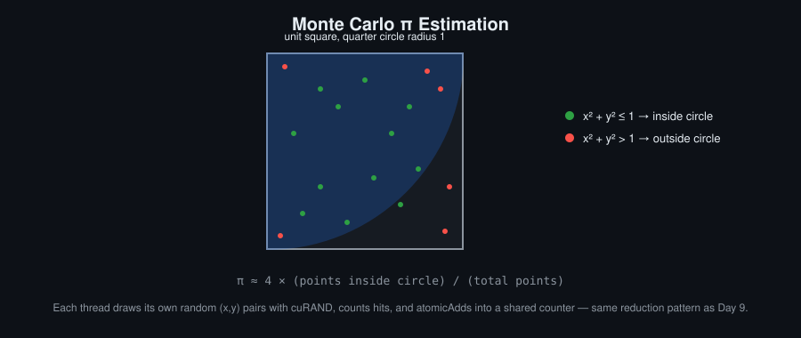

# Day 14: CUDA Libraries

## Objectives
- Use cuRAND to generate random numbers on the device
- Use cuBLAS for basic linear algebra
- Use cuFFT for FFT computation
- Understand recursive/dynamic-parallelism kernel launches at a high level
- Rewrite a hand-written warp reduction using cooperative groups, and know when a grid-wide barrier is available

## Key Concepts
- cuRAND (random generation)
- cuBLAS (linear algebra)
- cuFFT (FFT)
- Monte Carlo π estimation
- CUDA recursive kernel launch (dynamic parallelism)
- Cooperative groups: `tiled_partition`, group-typed shuffles, grid-wide sync

## Visual


Each thread generates its own stream of random points with cuRAND, tests each one against the circle, and contributes its count toward a shared total — the same warp-reduction + atomicAdd pattern from Day 9, just applied to random sampling instead of image data.

## Cooperative Groups

The libraries above are one way to stop hand-writing primitives. Cooperative groups are the other: a typed wrapper over the warp-level intrinsics from Days 8 and 9 that ships with CUDA and makes the participation question structural instead of a comment you hope stays true.

Recall the Day 8 reduction. Every `__shfl_down_sync` takes a mask of participating lanes, and passing `0xFFFFFFFF` is a promise that all 32 lanes are live. Inside a bounds check or a divergent branch that promise is a lie, and since Volta — where lanes really can sit at different instructions — the result is undefined behaviour, not merely a wrong number. Nothing in the type system stops you.

```c++
#include <cooperative_groups.h>
namespace cg = cooperative_groups;

__device__ int warp_reduce(int val)
{
    auto tile = cg::tiled_partition<32>(cg::this_thread_block());
    for (int offset = tile.size() / 2; offset > 0; offset /= 2) {
        val += tile.shfl_down(val, offset);   // mask derived from `tile`, not asserted
    }
    return val;                                // every lane holds the sum
}
```

`tile` *is* the set of participating threads, so the mask can't disagree with reality. The same object gives you `tile.shfl()`, `tile.any()`, `tile.all()`, `tile.ballot()` and `tile.sync()` — one-for-one with the intrinsics in [INTRINSICS.md](../INTRINSICS.md), minus the footgun.

Three things it buys beyond safety:

- **Sizes other than 32.** `cg::tiled_partition<8>(block)` gives four independent 8-thread groups per warp, each reducing separately. Writing that with raw shuffles means hand-computing masks.
- **Group granularity as a parameter.** A reduction written against `cg::thread_group` works on a tile, a block, or a grid without changing the body.
- **Grid-wide sync.** `cg::this_grid().sync()` is a barrier across *every* block — the thing `__syncthreads()` explicitly cannot do. It's the only way to do a multi-phase algorithm without returning to the host between phases. The catch: the kernel must be launched with `cudaLaunchCooperativeKernel`, and the grid must be small enough that all blocks are co-resident (query it with `cudaOccupancyMaxActiveBlocksPerMultiprocessor` — see Day 2), so it's a real constraint, not free.

Why this sits on the library day: it's the same trade as reaching for cuBLAS instead of writing your own GEMM. Someone else already got the edge cases right, the abstraction costs nothing at runtime (it compiles to the same SASS), and the version you'd write by hand is the version with the subtle mask bug. Tasks 91 and 97 in [TASKS.md](../TASKS.md) are the on-ramp.

## Hands-On Task
Estimate π using Monte Carlo sampling with cuRAND. Monte Carlo estimation is genuinely a pure-math task, not an image one — but [`template.cu`](template.cu) adds a bonus second part: fill a real `cv::cuda::GpuMat` with cuRAND-generated noise and display it, so today still touches `GpuMat` even though the core exercise doesn't need it.

## Self-Learning
1. Use cuRAND to generate uniform random points in `[0,1)^2` and estimate π via the classic Monte Carlo circle/square ratio.
2. Use cuBLAS to perform a matrix-vector multiply and compare against your Day 10 matrix multiplication kernel.
3. Use cuFFT to compute the FFT of a signal and compare against your Day 8 32-point FFT attempt.
4. (Stretch) Try a recursive/dynamic-parallelism kernel launch — have a kernel launch a child kernel.
5. Fill in `fill_noise_image` in [`template.cu`](template.cu) and display the result with `cv::imshow`.
6. Rewrite your Day 8 `warp_reduce_sum` using `cg::tiled_partition<32>` and confirm it produces the same answer. Then change the tile size to 8 and reason about what the four partial sums now represent.
7. (Stretch) Use `cg::this_grid().sync()` to do a two-phase reduction in a single kernel launch — no host round-trip between phases. You'll need `cudaLaunchCooperativeKernel` and a grid small enough for all blocks to be co-resident.

## Self-Check
No answers given — these are for you to reason through, or discuss with a classmate/instructor.

1. Why does each thread need its own `curandState` instead of every thread sharing one?
2. Why does the Monte Carlo pi estimate get more accurate with more samples but (in principle) never land on exactly π?
3. Why do GPUs older than Volta have zero tensor cores, and what does that mean for cuBLAS performance on them?
4. `cg::tiled_partition<32>(block)` and a raw `__shfl_down_sync(0xFFFFFFFF, ...)` compile to the same instruction. So what exactly does the cooperative-groups version prevent?
5. `__syncthreads()` synchronizes a block; `cg::this_grid().sync()` synchronizes the whole grid. Why does the second one require a special launch API and a limit on grid size, when the first doesn't?

## Code Template
See [`template.cu`](template.cu) for a skeleton to start from.
