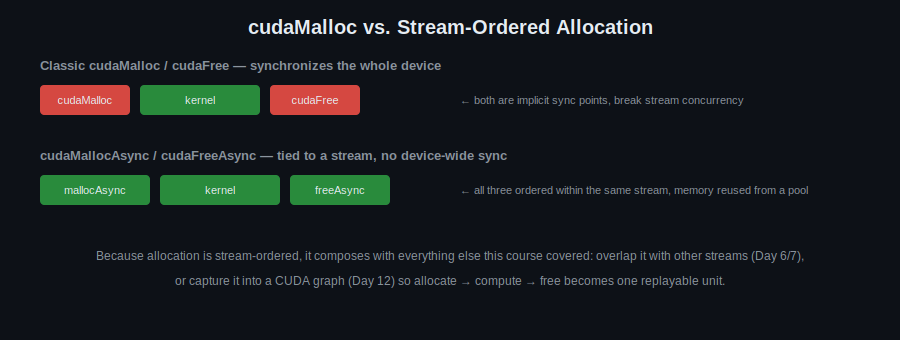

# Day 15: Stream-Ordered Memory Allocation

## Objectives
- Understand stream-ordered memory allocation semantics
- Use `cudaMallocAsync` / `cudaFreeAsync` correctly
- Use memory pools across multiple streams

## Key Concepts
- `cudaMallocAsync` / `cudaFreeAsync`
- Stream-ordered allocation semantics
- Memory pools

## Visual

`cudaMalloc`/`cudaFree` are safe but blunt — they force the whole device to sync, which quietly kills the overlap you worked to set up in Day 6/7. The async versions are ordered within a single stream instead, so allocation composes with everything else: overlapping streams, and even capture into a CUDA graph (Day 12).

## Resources
https://docs.nvidia.com/cuda/cuda-programming-guide/04-special-topics/stream-ordered-memory-allocation.html

https://medium.com/@dmitrijtichonov/cuda-series-memory-and-allocation-fce29c965d37

## Hands-On Task
Replace a `cudaMalloc`/`cudaFree` pair with the stream-ordered `cudaMallocAsync`/`cudaFreeAsync` equivalents.

## Self-Learning
1. Take a `cudaMalloc`/`cudaFree` pair from an earlier day (e.g. Day 2's vector add) and replace it with `cudaMallocAsync`/`cudaFreeAsync` on a stream.
2. Benchmark allocation overhead: `cudaMalloc`/`cudaFree` vs. `cudaMallocAsync`/`cudaFreeAsync` in a loop of many small allocations.
3. Create an explicit `cudaMemPool_t` and use it across multiple streams; verify correctness with concurrent allocations.
4. Combine stream-ordered allocation with the Day 12 CUDA graph capture — capture allocation, kernel, and free into one graph.

## Code Template
See [`template.cu`](template.cu) for a skeleton to start from.
