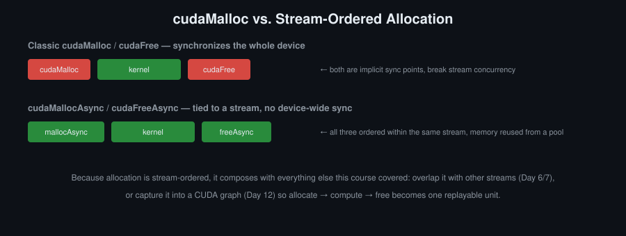

# Day 15: Stream-Ordered Memory Allocation

## Objectives
- Explain what "stream-ordered" guarantees, and what it does *not* guarantee across streams
- Use `cudaMallocAsync` / `cudaFreeAsync` correctly, including freeing memory a kernel is still using
- Inspect and tune a memory pool: release threshold, reserved vs. used, trimming
- Create an explicit `cudaMemPool_t` and drive it from multiple streams
- Combine stream-ordered allocation with CUDA graph capture (Day 12)

## Key Concepts
- `cudaMallocAsync` / `cudaFreeAsync`
- Stream-ordered allocation semantics; cross-stream use requires an explicit event dependency
- Memory pools: default vs. explicit, `cudaMemPoolCreate`, `cudaMallocFromPoolAsync`
- Pool attributes: `cudaMemPoolAttrReleaseThreshold`, reserved/used counters, `cudaMemPoolTrimTo`
- Why classic `cudaMalloc` can't be captured into a graph

## Visual


`cudaMalloc`/`cudaFree` are safe but blunt — they force the whole device to sync, which quietly kills the overlap you worked to set up in Day 6/7. The async versions are ordered within a single stream instead, so allocation composes with everything else: overlapping streams, and even capture into a CUDA graph (Day 12).

## What "Stream-Ordered" Actually Means

The name is precise, and the precision matters. `cudaMallocAsync` returns a pointer to the host **immediately**, before the allocation has happened on the device. What you get back is a promise: *by the time work you enqueue after this point in this stream runs, this memory will be valid.*

```c++
unsigned char *d_buf;
cudaMallocAsync(&d_buf, n, stream);   // returns instantly; d_buf usable *in stream*
kernel<<<g, b, 0, stream>>>(d_buf);   // fine: ordered after the alloc in this stream
cudaFreeAsync(d_buf, stream);         // returns instantly; frees *after* the kernel
```

That `cudaFreeAsync` is the part that looks wrong the first time you see it. You're freeing memory a kernel is still using — but you aren't, because the free is *also* ordered in the stream. It takes effect after everything already enqueued, and the allocator won't hand those bytes to anyone until then.

The rule this creates, and the way people break it:

```c++
cudaMallocAsync(&d_buf, n, stream1);
kernel<<<g, b, 0, stream2>>>(d_buf);   // WRONG: stream2 has no ordering vs stream1
```

Nothing makes `stream2` wait for `stream1`'s allocation. It may work on your machine, most of the time, and corrupt memory on a different GPU. To use an allocation in another stream you must create the dependency explicitly — a `cudaEvent` recorded on `stream1` and waited on in `stream2` (Day 6), which is the same tool you'd use for any other cross-stream ordering. There's nothing special about allocation here; that's the point of the design.

## Memory Pools

The speed comes from what's underneath: `cudaMallocAsync` doesn't ask the driver for memory, it takes it from a **memory pool** the driver already owns. Every device has a default pool, and a freed allocation goes back to that pool rather than to the OS — so the next `cudaMallocAsync` of a similar size is a pointer bump instead of a driver call. That's why the benchmark in task 2 shows such a wide gap: you aren't measuring a faster allocator, you're measuring the absence of one.

```c++
cudaMemPool_t pool;
cudaDeviceGetDefaultMemPool(&pool, /*device=*/0);
```

**The attribute that matters most: the release threshold.** By default the pool returns memory to the OS whenever the device synchronizes, which throws away the reuse you're trying to get. Set a threshold and the pool holds on to that many bytes instead:

```c++
size_t threshold = 256ull * 1024 * 1024;    // keep up to 256 MB cached
cudaMemPoolSetAttribute(pool, cudaMemPoolAttrReleaseThreshold, &threshold);
```

Use `UINT64_MAX` to mean "never release." This single line is usually the difference between `cudaMallocAsync` being marginally faster than `cudaMalloc` and being an order of magnitude faster in an allocate/free loop — worth measuring both ways in task 2.

Other attributes worth knowing. Note the naming: the *statistics* are `cudaMemPoolAttr…`, the *reuse policies* are `cudaMemPoolReuse…` with no `Attr` — an easy typo, and the compiler won't help you since both are just enum values passed to the same function.

| Attribute | What it does |
|---|---|
| `cudaMemPoolAttrReleaseThreshold` | Bytes to keep cached rather than return to the OS |
| `cudaMemPoolAttrReservedMemCurrent` | Physical memory the pool currently holds from the OS (read-only) |
| `cudaMemPoolAttrUsedMemCurrent` | How much of that is actually handed out right now (read-only) |
| `cudaMemPoolAttrReservedMemHigh` / `…UsedMemHigh` | High-water marks since the last reset. Writable — set to 0 to reset to the current value |
| `cudaMemPoolReuseFollowEventDependencies` | Before asking the OS for more, reuse memory freed in *another* stream when a recorded event makes it provably safe |
| `cudaMemPoolReuseAllowOpportunistic` | Reuse memory whose free has already completed on the GPU, without adding synchronization |
| `cudaMemPoolReuseAllowInternalDependencies` | Last resort before an OS allocation: let the driver silently insert a stream dependency so it can reuse pending memory |

All values are `cuuint64_t`, including the boolean-ish policy flags.

The `Reserved`/`Used` pair is the diagnostic: a large gap means the pool is hoarding memory your kernels aren't using. `cudaMemPoolTrimTo(pool, minBytesToKeep)` hands the excess back — worth calling before a phase that needs a large `cudaMalloc`, or before handing the GPU to another library. Sync first, so the trim knows what's genuinely free.

The three reuse policies are on by default and you'd usually leave them there, but they're worth knowing about for a reason that bites during debugging: `ReuseAllowOpportunistic` makes allocation depend on how far the GPU happens to have progressed, so **the same program can produce different allocation patterns run to run**, and `ReuseAllowInternalDependencies` lets the driver insert synchronization you didn't write. If you're chasing a non-deterministic bug or an unexplained serialization, turning both off is a useful bisection step.

**Reuse without any of that:** memory freed in a stream is immediately reusable by a later allocation *in that same stream* — that's the common case and needs no policy. Synchronizing a stream with the CPU releases its freed memory for reuse by any stream.

**Check support before you rely on it:** `cudaDeviceGetAttribute(&v, cudaDevAttrMemoryPoolsSupported, device)` (CUDA 11.2+), and `cudaDevAttrMemoryPoolSupportedHandleTypes` for IPC capability (11.3+).

**Explicit pools.** You can also create your own, which is what task 3 is about:

```c++
cudaMemPoolProps props = {};
props.allocType     = cudaMemAllocationTypePinned;
props.location.type = cudaMemLocationTypeDevice;   // or cudaMemLocationTypeHostNuma
props.location.id   = 0;                           // device 0
// props.handleTypes = cudaMemHandleTypePosixFileDescriptor;  // makes the pool IPC-capable

cudaMemPool_t myPool;
cudaMemPoolCreate(&myPool, &props);

void *ptr;
cudaMallocFromPoolAsync(&ptr, bytes, myPool, stream);
// ...
cudaFreeAsync(ptr, stream);       // note: no pool argument -- it knows
cudaMemPoolDestroy(myPool);
```

Why bother, when there's a default pool? Three reasons that come up in practice:

- **Isolation.** A separate pool per subsystem stops one component's allocation spike from evicting another's cached memory, and makes the `Used`/`Reserved` counters per-subsystem instead of global.
- **Different policies.** A pool for short-lived scratch buffers wants a high release threshold; a pool for occasional large allocations wants a low one. One default pool can only have one policy.
- **IPC.** Setting `handleTypes` makes a pool shareable with another process (`cudaMemPoolExportToShareableHandle` / `cudaMemPoolImportFromShareableHandle`, then `cudaMemPoolExportPointer` / `cudaMemPoolImportPointer` per allocation) — how multi-process pipelines pass device buffers without a round trip through host memory. **The default pool cannot do this**, which is the one capability you can only get from an explicit pool.

Pools are per-device, not per-stream. A single pool serves any number of streams, and the stream argument to `cudaMallocFromPoolAsync` says *when* the allocation happens, not *where it comes from*. That distinction is exactly what task 3 asks you to verify. (Each device also has a *current* pool — the one plain `cudaMallocAsync` uses — settable with `cudaDeviceSetMemPool` if you'd rather not thread a pool handle through your call sites.)

For multi-GPU, note that pool accessibility does **not** follow `cudaDeviceEnablePeerAccess`. Pools have their own mechanism, `cudaMemPoolSetAccess`, and it applies retroactively to every allocation from the pool, not just future ones.

**Where this pays off most.** Combine it with Day 12: a captured CUDA graph can contain `cudaMallocAsync`/`cudaFreeAsync` nodes, so a graph replayed a thousand times reuses the same pool memory with zero allocator calls per iteration. Classic `cudaMalloc` can't be captured at all — it synchronizes, and stream capture forbids that. Stream-ordered allocation is what makes a fully self-contained, replayable pipeline possible, which is why these two days sit next to each other.

Three sharp edges worth knowing before you hit them:

- `cudaPointerGetAttributes` on a pointer *after* `cudaFreeAsync` is undefined behaviour — even if the memory is still reachable from some stream.
- `cudaGraphAddMemsetNode` doesn't accept stream-ordered allocations. A `cudaMemsetAsync` captured into a graph is fine; explicitly adding the node isn't.
- IPC pools ignore both `cudaMemPoolTrimTo` and the release threshold — they don't return physical blocks to the OS at all.

## Resources
https://docs.nvidia.com/cuda/cuda-programming-guide/04-special-topics/stream-ordered-memory-allocation.html

https://medium.com/@dmitrijtichonov/cuda-series-memory-and-allocation-fce29c965d37

## Hands-On Task
Replace a `cudaMalloc`/`cudaFree` pair with the stream-ordered `cudaMallocAsync`/`cudaFreeAsync` equivalents — applied to a real image-contrast kernel (loaded via `cv::imread`) instead of a synthetic vector add.

## Self-Learning
1. Fill in `run_with_malloc_async` in [`template.cu`](template.cu): allocate with `cudaMallocAsync`, copy the loaded image in, run `adjust_contrast`, copy the result out, and free with `cudaFreeAsync` — all on the same stream.
2. Benchmark allocation overhead: `cudaMalloc`/`cudaFree` vs. `cudaMallocAsync`/`cudaFreeAsync` in a loop of many small allocations. Then run it again with `cudaMemPoolAttrReleaseThreshold` set to 256 MB and compare all three — the gap between the second and third run is the pool doing its job.
3. Create an explicit `cudaMemPool_t` and use it across multiple streams; verify correctness with concurrent allocations.
4. Combine stream-ordered allocation with the Day 12 CUDA graph capture — capture allocation, kernel, and free into one graph. Then try the same capture with plain `cudaMalloc` and read the error you get.
5. Print `cudaMemPoolAttrReservedMemCurrent` and `cudaMemPoolAttrUsedMemCurrent` before, during and after your allocation loop. Watch reserved memory grow and stay high; then call `cudaMemPoolTrimTo(pool, 0)` and watch it drop.
6. Deliberately write the cross-stream bug: allocate on `stream1`, launch a kernel using that pointer on `stream2` with no event between them. Does it fail? Run it under `compute-sanitizer` (Day 1) and see whether the tool catches what your eyes don't. Then fix it with a `cudaEvent` (Day 6).

## Self-Check
No answers given — these are for you to reason through, or discuss with a classmate/instructor.

1. Why does classic `cudaMalloc`/`cudaFree` act as an implicit device-wide synchronization point?
2. "Stream-ordered" is in the name `cudaMallocAsync` — ordered relative to what, specifically?
3. Why would you combine stream-ordered allocation with a CUDA graph (Day 12) instead of just using one or the other?
4. `cudaFreeAsync(d_buf, stream)` returns while a kernel using `d_buf` is still queued on that stream. Why isn't that a use-after-free?
5. The default release threshold is 0, meaning the pool hands memory back to the OS at every device sync. Why would NVIDIA choose that as the default, given how much faster a high threshold is?
6. Reserved memory is 512 MB and used memory is 8 MB. What is that telling you, and when does it matter?
7. A pool is per-device, but `cudaMallocFromPoolAsync` takes a stream. What is the stream argument actually deciding?

## Code Template
See [`template.cu`](template.cu) for a skeleton to start from.
